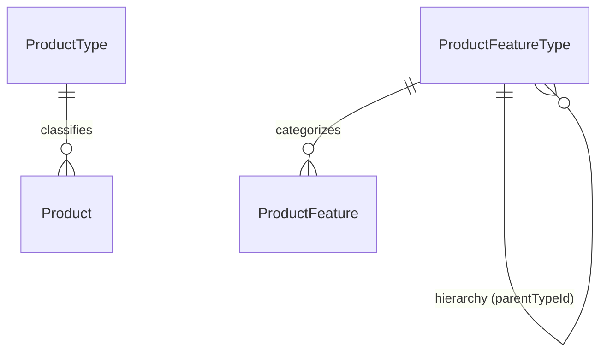
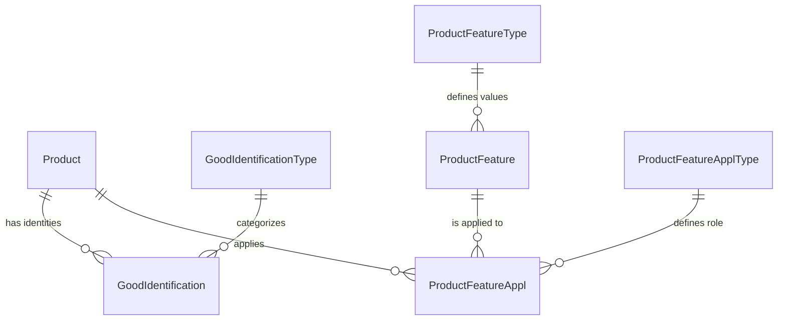
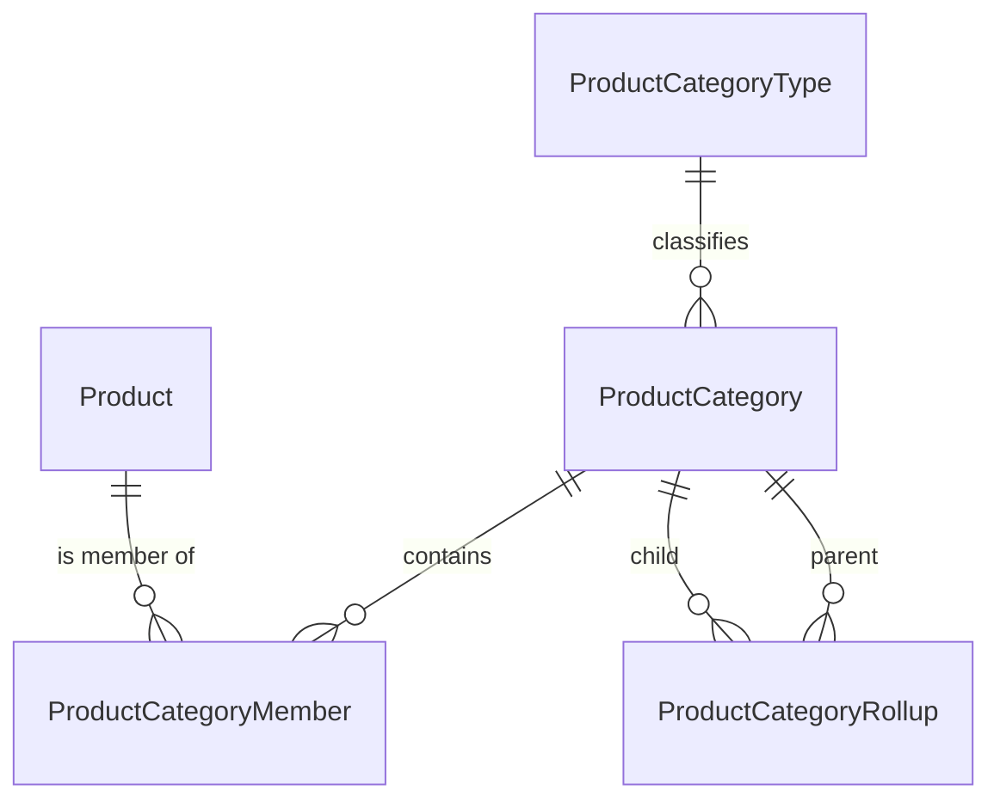
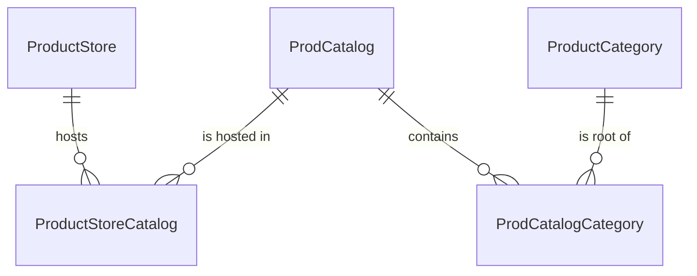
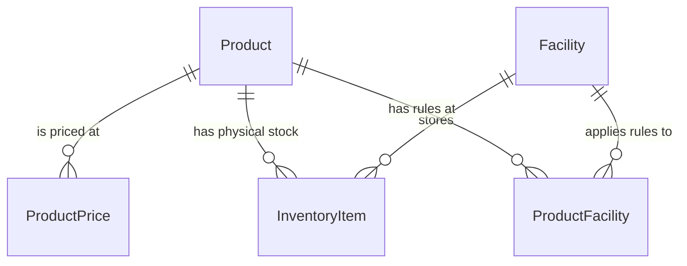

# HotWax Commerce: Master Product Architecture & Data Flow

This document is a technical deep dive into the HotWax/OFBiz product data model. It is designed for a developer to understand the **ER Diagram Flow** and the **Sync Sequence**.

---

## The Master Scenario: "The Organic Cotton Hoodie"
We will follow this product through every table:
- **Shopify Handle**: `organic-cotton-hoodie`
- **Internal ID**: `ECO_HOODIE`
- **Variants**: Red/Small (`ECO_HOODIE_RED_S`)
- **SKU**: `HOODIE-RED-S`

---

# Phase 1: The Rulebooks (Seeded Core)
Before data enters, the "Logic Gates" must be defined.

## 1. ProductType (The Master Classifier)
**Entity Name**: `ProductType` | **Table**: `PRODUCT_TYPE`

### A. Deep Dive
Every record in the `Product` table **must** have a type. This determines the behavior of the product.
- **isPhysical**: If 'Y', the system knows this item needs a warehouse and a shipping label.
- **isDigital**: If 'Y', the system ignores inventory and sends a download link.

### B. ER Communication (The Flow)
- **Relationship**: `ProductType` (1) $\rightarrow$ `Product` (Many).
- **FK Logic**: The `productTypeId` in the `Product` table points here. You cannot create a product unless its type is already in this table.

### C. The "Aha!" Moment
If you want to sell "Gift Cards," you don't write new code. You simply add a `ProductType` called `GIFT_CARD` and set `isPhysical='N'`. The entire OMS will now treat it as a non-shipping item.

### D. Data Provenance (Seed vs. Sync)
- **Source**: 100% Seeded (`ProductSeedData.xml`).
- **Sync Role**: The Shopify sync reads this to assign `FINISHED_GOOD` to all imported items.

### E. XML Format
```xml
<ProductType productTypeId="FINISHED_GOOD" isPhysical="Y" isDigital="N" description="Sellable Item"/>
```

---

## 2. ProductFeatureType (The Question)
**Entity Name**: `ProductFeatureType` | **Table**: `PRODUCT_FEATURE_TYPE`

### A. Deep Dive
Defines the **categories** of variation. It doesn't know "Red"; it only knows "Color."

### B. ER Communication (The Flow)
- **Relationship**: `ProductFeatureType` (1) $\rightarrow$ `ProductFeature` (Many).
- **FK Logic**: Acts as the parent for all specific features.
- **Hierarchy**: Uses `parentTypeId` to group features (e.g., `WIDTH` and `HEIGHT` under `DIMENSION`).

### C. The "Aha!" Moment
When you see a "Filter by Color" sidebar on a website, the website is querying **this** table to find the header "Color."

### D. Data Provenance
- **Source**: Seeded (`COLOR`, `SIZE`, `BRAND`).
- **Sync Role**: Maps Shopify "Options" (Option1, Option2) to these types.

### E. XML Format
```xml
<ProductFeatureType productFeatureTypeId="COLOR" description="Color"/>
```

---

## Phase 1: Relationship Diagram


---

# Phase 2: The Core Sync (Anchor Entities)

## 3. Product (The Virtual Parent)
**Entity Name**: `Product` | **Table**: `PRODUCT`

### A. Deep Dive
The "Virtual" product is the **Master Concept**. It is not a physical object you can touch; it is the "Idea" of the hoodie.
- **isVirtual**: Set to 'Y'.

### B. ER Communication (The Flow)
- **Relationship**: It is the "Anchor." Almost every table in this document will have a `productId` column pointing here.
- **Communication**: It passes its `productName` and `description` down to its variants if they are missing their own.

### C. The "Aha!" Moment
You never ship a Virtual product. It only exists to hold the "Common Data" so you don't have to type the description 20 times for 20 sizes.

### D. Data Provenance
- **Source**: 100% Sync/Customer Added.
- **Shopify Logic**: The first time a product is seen, the sync creates the Virtual record first.

### E. XML Format
```xml
<Product productId="ECO_HOODIE" productTypeId="FINISHED_GOOD" isVirtual="Y" productName="Organic Hoodie"/>
```

---

## 4. Product (The Variant Child)
**Entity Name**: `Product` | **Table**: `PRODUCT`

### A. Deep Dive
The "Variant" is the **Physical Unit**. This has a barcode and sits in a warehouse.
- **isVariant**: Set to 'Y'.
- **isVirtual**: Set to 'N'.

### B. ER Communication (The Flow)
- **Relationship**: Linked to the Virtual parent via `ProductAssoc`.
- **Identity Link**: This record is what the `GoodIdentification` (SKU) actually points to.

### C. The "Aha!" Moment
When an order is placed, the `OrderItem` table points to **this** ID, never the Virtual ID.

### D. Data Provenance
- **Source**: Sync Added.
- **Shopify Logic**: Created for every unique combination of Color/Size.

### E. XML Format
```xml
<Product productId="ECO_HOODIE_RED_S" productTypeId="FINISHED_GOOD" isVariant="Y" isVirtual="N" internalName="Hoodie-Red-Small"/>
```

---

## 5. ProductAssoc (The Glue)
**Entity Name**: `ProductAssoc` | **Table**: `PRODUCT_ASSOC`

### A. Deep Dive
The "Junction" that creates the family tree.
- **productAssocTypeId**: Usually `PRODUCT_VARIANT`.

### B. ER Communication (The Flow)
- **Relationship**: `Product` (Parent) $\rightarrow$ `ProductAssoc` $\rightarrow$ `Product` (Child).
- **PK Logic**: `[productId, productIdTo, productAssocTypeId, fromDate]`.
- **Direction**: `productId` is the Parent; `productIdTo` is the Child.

### C. The "Aha!" Moment
Because this has a `fromDate` and `thruDate`, you can see the history. If a variant is moved to a different parent, you don't delete the record; you just expire the old association.

### D. Data Provenance
- **Source**: Sync Added.
- **Shopify Logic**: Populated immediately after the Virtual and Variant are created to "link" them.

### E. XML Format
```xml
<ProductAssoc productId="ECO_HOODIE" productIdTo="ECO_HOODIE_RED_S" productAssocTypeId="PRODUCT_VARIANT" fromDate="2024-05-12 00:00:00.0"/>
```

---

# Phase 3: Identifiers & Features (The Translation Layer)

## 6. GoodIdentificationType (The Rulebook)
**Entity Name**: `GoodIdentificationType` | **Table**: `GOOD_IDENTIFICATION_TYPE`

### A. Deep Dive
Defines the **Categories of Names**. You cannot label a product with a "SKU" unless the concept of a "SKU" is defined here.

### B. ER Communication (The Flow)
- **Relationship**: `GoodIdentificationType` (1) $\rightarrow$ `GoodIdentification` (Many).
- **FK Logic**: Every entry in the `GoodIdentification` table must point to a valid type here.

### C. The "Aha!" Moment
Your system uses `SHOPIFY_PROD_ID` as a type. This allows the Shopify Sync to find the internal product by using the Shopify ID as a lookup key.

---

## 7. GoodIdentification (The Translation)
**Entity Name**: `GoodIdentification` | **Table**: `GOOD_IDENTIFICATION`

### A. Deep Dive
The **Bridge** between the Database ID (`ECO_HOODIE_RED_S`) and the Human ID (`HOODIE-RED-S`).

### B. ER Communication (The Flow)
- **Relationship**: `Product` (1) $\rightarrow$ `GoodIdentification` (Many).
- **PK Logic**: `[productId, goodIdentificationTypeId]`.

### C. The "Aha!" Moment
When you scan a barcode at the POS, the code doesn't look at the `Product` table. It looks **here** to find the `productId` that matches the scanned string.

### D. XML Format
```xml
<GoodIdentification productId="ECO_HOODIE_RED_S" goodIdentificationTypeId="SKU" idValue="HOODIE-RED-S"/>
```

---

## 8. ProductFeature (The Dictionary)
**Entity Name**: `ProductFeature` | **Table**: `PRODUCT_FEATURE`

### A. Deep Dive
The **Global List** of all possible characteristics.

### B. ER Communication (The Flow)
- **Relationship**: `ProductFeatureType` (1) $\rightarrow$ `ProductFeature` (Many).

### C. The "Aha!" Moment
"Red" is defined once in this table. If you have 10,000 red shirts, they all point to this **single** row. This is the heart of Data Normalization.

---

## 9. ProductFeatureApplType (The Role)
**Entity Name**: `ProductFeatureApplType` | **Table**: `PRODUCT_FEATURE_APPL_TYPE`

### A. Deep Dive
Defines **how** a feature is applied.
- **`SELECTABLE_FEATURE`**: Choice (Virtual).
- **`STANDARD_FEATURE`**: Fact (Variant).

---

## 10. ProductFeatureAppl (The Glue)
**Entity Name**: `ProductFeatureAppl` | **Table**: `PRODUCT_FEATURE_APPL`

### A. Deep Dive
The **Junction** that binds a Feature to a Product.

### B. ER Communication (The Flow)
- **Relationship**: `Product` (Many) $\leftrightarrow$ `ProductFeature` (Many).
- **PK Logic**: `[productId, productFeatureId, fromDate]`.

---

## Phase 3: Relationship Diagram


---

# Phase 4: Organization & Categories (The Shelf Layer)

## 11. ProductCategoryType (The Rulebook)
**Entity Name**: `ProductCategoryType` | **Table**: `PRODUCT_CATEGORY_TYPE`

### A. Deep Dive
Defines the **Nature** of a category. Not all categories are for browsing.

---

## 12. ProductCategory (The Shelf)
**Entity Name**: `ProductCategory` | **Table**: `PRODUCT_CATEGORY`

### A. Deep Dive
The **Logical Container**. It is just a "Named Box" (e.g., "Men's Sweaters").

### B. XML Format
```xml
<ProductCategory productCategoryId="MENS_SWEATERS" productCategoryTypeId="CATALOG_CATEGORY" categoryName="Men's Sweaters"/>
```

---

## 13. ProductCategoryMember (The Placement)
**Entity Name**: `ProductCategoryMember` | **Table**: `PRODUCT_CATEGORY_MEMBER`

### A. Deep Dive
The **Junction** that puts a Product onto a Shelf.

### B. ER Communication (The Flow)
- **Relationship**: `Product` (Many) $\leftrightarrow$ `ProductCategory` (Many).
- **PK Logic**: `[productCategoryId, productId, fromDate]`.

### C. The "Aha!" Moment
The `sequenceNum` in this table is the "Magic Number" for commerce. It tells the website exactly which order to display the products on the screen.

---

## 14. ProductCategoryRollup (The Hierarchy)
**Entity Name**: `ProductCategoryRollup` | **Table**: `PRODUCT_CATEGORY_ROLLUP`

### A. Deep Dive
The **Tree Builder**. Links one category to another.

---

## Phase 4: Relationship Diagram


---

# Phase 5: The Storefront Layer (Visibility & Rules)

## 15. ProductStore (The Brain)
**Entity Name**: `ProductStore` | **Table**: `PRODUCT_STORE`

### A. Deep Dive
The **Highest Configuration Point**. It defines the environment for a Shopify store or a physical retail outlet.

### B. ER Communication (The Flow)
- **Relationship**: It is the "Context Anchor." Every order and sync event happens *inside* a `ProductStore`.
- **Inventory Link**: It has an `inventoryFacilityId` field which tells the system: *"If an order comes from this store, look in THIS warehouse for stock."*

### C. The "Aha!" Moment
If you have a Shopify store in the US and one in Canada, you have two `ProductStore` records. Even if they sell the same Hoodie, they can have different tax rules, different currencies, and ship from different warehouses.

### D. XML Format
```xml
<ProductStore productStoreId="STORE_USA" storeName="Shopify US" inventoryFacilityId="US_WH" defaultCurrencyUomId="USD"/>
```

---

## 16. ProdCatalog (The Department)
**Entity Name**: `ProdCatalog` | **Table**: `PROD_CATALOG`

### A. Deep Dive
A **Container for Categories**. It is used to logically group items for a specific purpose (e.g., "Wholesale Catalog").

---

## 17. ProductStoreCatalog (The Visibility Link)
**Entity Name**: `ProductStoreCatalog` | **Table**: `PRODUCT_STORE_CATALOG`

### A. Deep Dive
The **Junction** that decides which Catalog is shown in which Store.

### B. ER Communication (The Flow)
- **Relationship**: `ProductStore` (Many) $\leftrightarrow$ `ProdCatalog` (Many).

---

## 18. ProdCatalogCategory (The Menu Root)
**Entity Name**: `ProdCatalogCategory` | **Table**: `PROD_CATALOG_CATEGORY`

### A. Deep Dive
The **Bridge** between a Catalog and its Categories.
- **prodCatalogCategoryTypeId**: Usually `PCCT_BROWSE_ROOT`.

### B. ER Communication (The Flow)
- **Relationship**: This is the "Entry Point" for the category tree. Once the system finds this root, it uses the `ProductCategoryRollup` table to build the rest of the menu.

---

## Phase 5: Relationship Diagram


---

# Phase 6: The Physical Layer (Money & Stock)

## 19. ProductPrice (The Value)
**Entity Name**: `ProductPrice` | **Table**: `PRODUCT_PRICE`

### A. Deep Dive
Stores the **Financial Worth** of a product.

### B. ER Communication (The Flow)
- **Relationship**: `Product` (1) $\rightarrow$ `ProductPrice` (Many).

### C. The "Aha!" Moment
Prices are **Temporal**. You can schedule a price change for next Friday by creating a new record with a future `fromDate`. The system will automatically switch to the new price when the clock hits that time.

---

## 20. InventoryItem (The Physical Unit)
**Entity Name**: `InventoryItem` | **Table**: `INVENTORY_ITEM`

### A. Deep Dive
Tracks the **Actual Stock** sitting in a bin in a warehouse.

### B. ER Communication (The Flow)
- **Relationship**: `Product` (1) $\rightarrow$ `InventoryItem` (Many).
- **Facility Link**: Points to the `Facility` (Warehouse) where the item is located.

### C. The "Aha!" Moment
This is where the difference between **ATP** (Available to Promise) and **QOH** (Quantity on Hand) is stored. QOH is what's physically there; ATP is what's left after you subtract the items already promised to other customers.

---

## 21. ProductFacility (The Fulfillment Rules)
**Entity Name**: `ProductFacility` | **Table**: `PRODUCT_FACILITY`

### A. Deep Dive
Stores **Replenishment Rules** for a specific product at a specific location.

### B. ER Communication (The Flow)
- **Relationship**: Links `Product` to `Facility`.

### C. The "Aha!" Moment
This table is where you set "Safety Stock." If you tell the system that the `minimumStock` is 10, the OMS will stop selling the item on Shopify when you only have 10 left, to prevent overselling.

---

## Phase 6: Relationship Diagram


---

# Final Summary: The Lifecycle of a Shopify Sync
1.  **Phase 1 (Pre-Check)**: System confirms the **Types** (Product, Feature, Category) are seeded.
2.  **Phase 2 (Anchor)**: **Virtual** hoodie is created; then **Variant** is created; then **Linked**.
3.  **Phase 3 (Enrich)**: **SKUs** are mapped; **Features** (Red, Small) are created and "glued" to the products.
4.  **Phase 4 (Place)**: Product is put into **Categories** (Collections) and sorted via `sequenceNum`.
5.  **Phase 5 (Show)**: The **Store** and **Catalog** rules are checked to make the product visible.
6.  **Phase 6 (Activate)**: **Price** is set and **Inventory** is updated. The product is now ready to sell!
