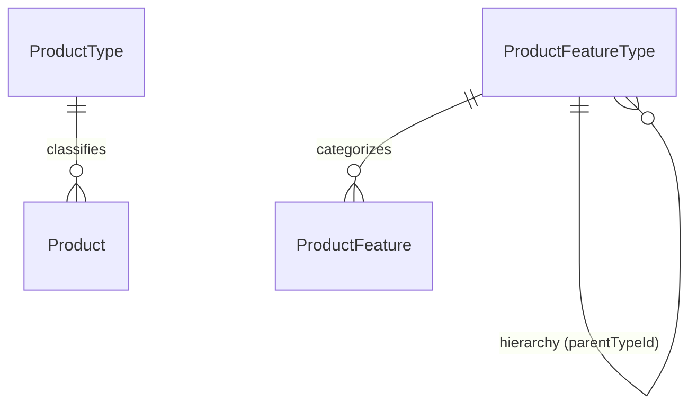
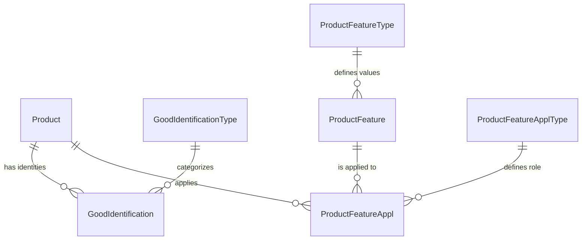
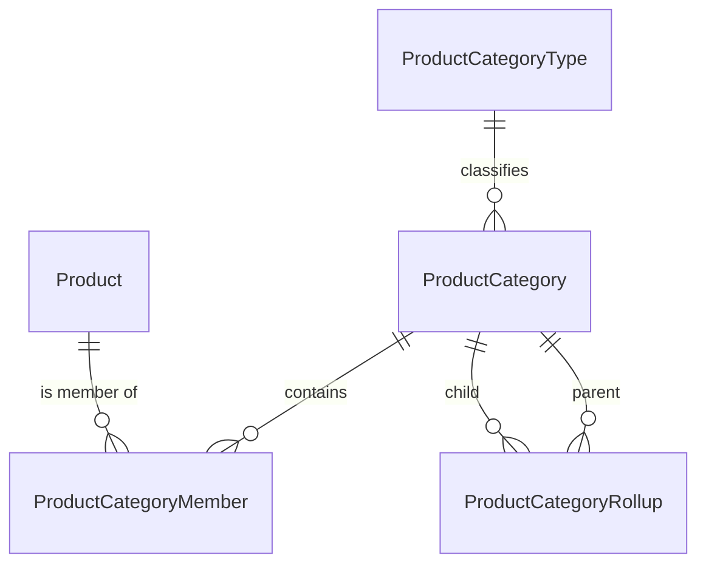
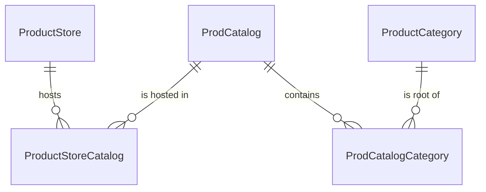
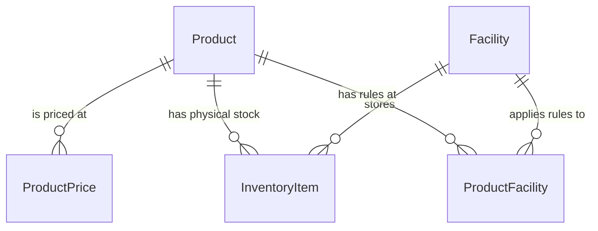

# todo - all
## What I did today:
- Attended a Data Model session and learned about entities related to UserLogin.
- Practised SQL queries on JOINS, NESTED GROUP BY, and started learning about CTE.
- Understood a Business requirement - on Pre Orders (OMS redesign module) and started collecting resources to write MySql query for the same.
https://docs.google.com/document/d/1_6bEWOukw7VEECVV8eSeJCU95uIxSZQWXAGGl7hh1RI/edit?tab=t.g8a6986um3 
- Downloaded Postman for further API Testing
- Completed Apache OFBiz 24.9 local setup - https://github.com/apache/ofbiz-framework/tree/release24.09 and started assignment:4.
- Read on Microservices communication mechanisms types.
- Read about the meaning behind commands that we use while setup.
- Learnt new keywords: Wave picking, SSO.

## What will I do tomorrow:
- Will check where SSO is used in code, check user login code in detail.
- will read blogs on pre orders, check internals, write initial query for the Business.

## Blockers: 
None
- all order lc diagrams
- Started understanding the "Product entity".
- Tracked down UserLoginEntities by UI and actual db match
- Visited Apache website to check mirroring of bugs
https://github.com/vaibhaviupreti-hotwax/scrum

-- HotWax Commerce Metrics Framework
-- https://github.com/saastechacademy/foundation/blob/main/project-ideas/fulfillment-center-mgmt/readme.md
   fulfillment document
---
# Global Assignments

- Setup (apache moqui all for assignment 4)
- Blogs (anil sir - by month end read 1 blog/week)
- Party data model assignment - weekend takk (parnika mam may-06)
---
# Order Processing and Architecture

## Order Lifecycle
- Created
- Broker
- Allocate
- Ship
- Complete in OMS
- Shopify sync fulfillment

## Point of Sale (POS)
- Direct completed - if paid
- ATP (Available to Promise): broker
  - QOH (Quantity on Hand): completed
  - Shopify order - both decremented

## Payment Status
- Pending/Authorized

## Cart Processing
- Send sale - from shop
- Mixed cart - completed + approved

## Tool Factory Pattern
- Lifecycle with instance:
  - init()
  - getInstance()
  - destroy()
- Interface definitions
- Plugins - tool factory init to destroy lifecycle
- Cache manager / SMTP server management
- Lifecycle cleanup / instance cleanup on destroy()

## Key Components
- **hotwax-marg-util**: Authentication and 3rd party integrations
- **Order-related SQS**: Queue service for order messaging
- **mantle-shopify-connector**: Syncs and connects Shopify data via connector
--
# Session 10:30 - Notes

## Discussed about:

- **User_Login entity** - party ID
- **Security_permission entity** - all permissions defined: pick/pack/view permissions
- **Security_Group** - different type of user - admin, picker
- **Security_Group_Permission ASSOC**
- **UserLoginSecurityGroup** — when user is linked to security group—group ID SUPER—user ke according
- It is an Example of a party classification group entity

---

## Ashish sir talked about 

### Setup to do asap
- 24-09 ofbiz setup - challenges
- Postman REST API testing 

### Authentication 
- A deprecated approach is asking Security questions - their management is tricky. 
- Same goes for password history. No need to manage now

### SSO
- Login on standalone app vs sso app for multiple applications. Why came?
- Existing software for SSO?

---

## Read more:

### Microservices architecture ? 
- How data is communicated/shared/interacted ?
- Communication protocol - socket io etc/http too.. 
- Forms of data sharing - json/xls/plain-text/xml
- Http status codes. Client server architecture data response/code - 200/300
- OFbiz using REST - communicate with - magento / shopify /others

### Token generation and calling REST api
- User login entity importance understanding
- token/security key concept
- Permission: role based access - component specific and super permission

### Entities and data + business in assignment
- Jira, Atlassian, Confluence uses ofbiz in Entity and Service engine. 
- Atlassion crowd - example of SSO application (how it really works in ofbiz etc..)

### Infrastructure
- 90-95% servers are set on LINUX - package: Lightweight directory access protocol

### Additional Topics
- Read about Disable flag for user 

### Important Links
- https://github.com/apache/ofbiz-framework 
- Read about Gradlew build tool - why is it needed? + related commands - load all, clean all..

### Upcoming Learning
- User login and security aspect - framework - behind the scene work. - java file - security - crud - all permissions- how managed on FW side..?  - important - to think next level..
- User login - password - encrypted - SHA algo 256/512 - 1 way and 2 way encryption
- Encryption algorithms are mathematical procedures that transform data (plaintext) into an unreadable format (ciphertext) using keys to ensure confidentiality. They are primarily divided into symmetric (single key for encryption/decryption) and asymmetric (public-private key pair) types. Common robust algorithms include AES (used by governments), RSA (for secure transmission), and ECC (efficient for IoT).

### Assignments
- **Parnika mam Assignment:**
  - Next day: Product data model..  
  - Data model 3rd chapter
  - Party data model assignment - weekend takk

---

## Caution
- Next gen shopify shop access token - don't use anywhere
----
What I did today:
- Studied business requirement for Pre Orders and explored blogs for the same (OMS redesign module)
- Revised new order sync architecture. asked ques from bot [https://shopify.dev/docs/api/admin-graphql/latest/queries/order?language=graphql] and discovered a bug: deprecated field: "LineItem.FulfillmentService".
- Discussed Product Entities with Purshottam sir and about our upcoming tasks related to product sync  

What will I do tomorrow:
- Verify and complete the Product entity understanding in the data model.
- Follow up on the execution of order lifecycle diagrams and system flows.
- Validate UserLogin entity behavior through code and database mapping.

Blockers: none

References / links:
- https://www.hotwax.co/blog/4-key-benefits-of-pre-orders-for-retailers
- https://claude.ai/chat/37ab6203-b7ba-48a2-b84d-22740604f7d1
- https://github.com/saastechacademy/foundation/blob/main/project-ideas/fulfillment-center-mgmt/readme.md
- https://chatgpt.com/c/69fae201-7e18-8321-ace7-d85e0937ed05
- https://www.arcserve.com/blog/5-common-encryption-algorithms-and-unbreakables-future
- https://github.com/saastechacademy/foundation/blob/main/udm/readme.md#chapter-2-people-and-organizations
- https://dev-oms.hotwax.io/webtools/control/FindGeneric?entityName=OrderItemShipGroup [ASSIGNMENT HELP]

Notes:
- Traced entities related to UserLogin.
- Learned CTE.
- Understood the Pre Orders business requirement (OMS redesign module) and collected resources to write the MySQL query.
- Downloaded Postman for further API testing.
- Completed Apache OFBiz 24.9 local setup and started Assignment 4.
- Read about microservices communication mechanisms and how services interact.
- Read about the meaning behind setup and build commands.
- Learned new keywords: Wave picking and SSO.
- Reviewed order lifecycle diagrams.
- Started understanding the Product entity.
- Tracked UserLogin entities from UI to the actual database.
- Visited the Apache website to check bug mirroring and issue tracking.
- Reviewed HotWax Commerce Metrics Framework materials.
- Checked fulfillment documentation and related reference links.

- The May 06 task list above is included and marked as complete in this report for tracking.
- Actual execution and verification of some items are still pending and will continue tomorrow.

- We need to understand the different scenarios and possible ways to optimize this query. [priority]
- https://dev-oms.hotwax.io/webtools/control/FindGeneric?entityName=ProductKeyword

=========================================================================================

RDS (Relational Database Service) notes:
- oms product data model vs shopify data model - mapping where to where?
- product sync
- oms tables for product sync and shopify data - origin?
- shopify object will act as a schema
- Moqui documentation: System Message Concept and MDM
- Shopify GraphQL, Query Hit, Bulk operations
- Shopify MCP and Bot
- OMS product data model notes - priority***
- Shopify product-specific data model notes
- product sync details
- system message concepts
- multiple Shopify shops in one product store - complexity
- Shopify bulk operations
- product
- prod-feature
- prod-assoc
- 14 - catalog
- 12 - prodPrice - core
- 11 -

Mentor task (separate):
- This is the task I got from mentor, kept separate after RDS.
- Focus on business requirement and product data model mapping for Pre Orders.
- Review Shopify sync behavior with OMS product model and system messages.

===================================================
communication medium - webhooks/rest api/graph ql/ web socket. 
sql
java
order LC, store LC, WH LC
Module 0 moqui assignment 
shopify integration
uml
data model - party and contact mech
what we import from shopify - integration
product and order import 

ofbiz flow and moqui flow

OFBiz: first req is rest req. job is already scheduled
sendShopifyRequest(send payload to this- order request). it is a general class. same for all rest end points
importShopifyOrders[hits rest and brings data], importShopifyOrderByID [two jobs/...]
uploadAndImportFile - read import shopify order service - java code
mdm gave config id - decides which service to call at runtime - already decided mapped kis config id ke against konsi service chalegi

process pending job - check in job mgr- chck all mdm/15 min - takes configID - iske correspond konsi service call karni hai?[iska khudka data model hai usse ye above cheez pata chalti hai - transform ka logic hai isme]

ofbiz documentation - tutorial... 

sync_shopify_orders - moqui
mother service - consume_shopify_orders - moqui
checks status - what has come and calls resp service
shopify- update history table - hash for every value is stored here, diff in hash means there is an update in order - we use update history table so we do not hit tx db again and again


webhook me sqs ki url rehti hai - 


system message ka flow

order sync ka flow old hai kayi clients 


===================================================
yes it is clear now, i am telling you everything from the beginning to end. our goal is to import orders from shopify to our dev oms environment, so first of all we subscribe to a webhook: "generally it is /updated as we dont want to pay for multiple and our req is to get orderId only due to reliability and scalability purpose. after webhook subscription, anytime change occur shopify service will ping oms via webhook json - and we will extract orderId from that", after this the main job starts, there is a service in backend that runs and creates a graphql payload to send back to shopify to extract order details - only needed- via http post request and for this we hit shopify's url.json that in response provides json response having order details. the internals  of this are: before service runs it needs data in proper format so variables are injected by xyz? - then format is made by ftl wrapper template, it maps the order id in the graphql(is it already done  - as i said?) and 2 more tasks the ftl performs swapping variables and cleaning the query and making it in a single line rather than nesting- removing spaces etc happens, then it is returned to facade which forwards this clean query back to shopify. 
---
## What I did today:
- Worked on requirement and entity identification for Pre-Orders in OMS.
- Ran SQL queries to understand product-related entities, database terminologies, and product modeling concepts including variants, bundles, and product features.
- Revised Order import flow and checked sequence of services and created Order LifeCycle UML.
- Clarified the flow: Shopify->webhook->EventBridge->SQS. 

## What will I do tomorrow:
- Will create real world use case for pre-orders.
- Will create real world use case for Product sync.

## Blockers: 
None
---
# End of Day (EOD) Report — May 09, 2026

## What I did today:
- Learnt technical perspective of Mother Service and Order Sync flow in Shopify and OMS; understood the need to integrate different systems and handle bulk updates in regular terminology.
- Gained insights from the session with Anil Sir on **Bulk Query Lifecycles** (asynchronous).
- Learnt important entities used in the **Order Shipment** flow.

## What will I do next:
- Will work on the above topics, assignments, Data Model, and code base tracking.
- Will learn about the **Product Sync** environment and flow.

## Blockers:
- None
---
# Session Notes - 3:00 PM (May 09)

*   **Order Component Directory**: Analyze the `order` component directory to understand how the system organizes order-related services, entities, and UI components.
*   **Order Types**: Explore the different classifications of orders in OFBiz, such as Sales Orders (customer-facing) and Purchase Orders (vendor-facing).
*   **SendSale CSR/Customer Roles**: Study the "Send Sale" business process where a CSR places an order for a customer.
    *   **Technical Detail**: Unlike a direct POS sale, a "Send Sale" is treated as a remote order and **will always require a shipping address**.
    *   **What to do**: Locate where the shipping address is stored for these orders (likely `OrderItemShipGroup` or `PostalAddress` linked via `OrderContactMech`).

pos mein bina customer ka order, no bill - db entry.
order -> return is more complex
order sync - event bridge and sqs ++ many things - oms order/types/kese aata hai order/ methods/ shipping address/ payment methods.
2 payment methods -> split payment
---
scenarios:
order test scenarios 
order adjustments
---
Edited session-3pm.md
Viewed session-3pm.md:1-17

A **Mixed Cart** order is one where the customer has items with different fulfillment requirements in a single checkout. Here are the core points:

1.  **Multiple Ship Groups**: This is the most critical technical point. The order must be split into multiple `OrderItemShipGroup` records—for example, one for "Ship to Home" items and another for "Store Pickup" (BOPIS) items.
2.  **Split Fulfillment**: The system processes parts of the order differently. The "Ship to Home" part might go through the **Brokering** engine to find the best warehouse, while the "Pickup" part is immediately routed to the specific store the customer chose.
3.  **Inventory Locking**: Inventory for pickup items is typically reserved at the chosen store immediately, while shipping items might have inventory reserved at a central warehouse.
4.  **Tax & Shipping Complexity**: Taxes may be calculated differently for items being picked up (using store location tax) vs. items being shipped (using customer's home address tax). 
5.  **Partial Completion**: A Mixed Cart order can be "Partially Completed." For example, the customer picks up their shoes at the store today (completing that part), but their jacket is still being shipped from the warehouse (keeping the overall order status as "Approved" or "Processing").
6.  **Mixed Types**: It also refers to carts containing both **Physical Products** and **Digital/Service Products** (like a Gift Card or a Warranty), which don't require shipping at all.
---
Edited session-3pm.md
Viewed session-3pm.md:20-32

A **Cash Sale** is an immediate "Take-with" transaction where the order is created, paid for, and marked as **Completed** all at once because the customer takes the product immediately. 

**How it’s different from a POS Category:**
*   **POS Category** is a way to **group products** (e.g., "Best Sellers" or "Drinks") so they show up on the POS screen for the cashier to find.
*   **Cash Sale** is the **Order Type/Flow**. You can pick a product from a "POS Category" and choose to process it as a "Cash Sale" (take now) or a "Send Sale" (ship to their home later). One is a menu organization; the other is a fulfillment method.
---
OrderAdjustment Entity
---
CashSale

mdm service - mother service - all scenarios covered here
---
order and returns scenarios - today's objective - done in actual when we will explore return service
---
sqs tool factory
methods -6: nikunj
writing in file: batch file is uploaded - data goes to MDM. 
and when it is uploaded?
deletion
---
now file is in MDM
---
mother service
==============
syncSgopifyOrder
file status in MDM?
pending->runner(running)->goes to SyncShOrder Service
processing time default - 2hrs- running 
but file payload (max 10)- per payload deafult time is 60 sec | processing and commit

file up - > 1st order- > SyncShopifyOrders.groovy[shopId and payload?]
service verb="sync"

why file is stored in mdm?

consume service internally called:
cases: order-line items/tx
pos data fiels to know which is the field

---
query MegaOrderQuery($firstOrders: Int!, $firstLineItems: Int!) {
  orders(first: $firstOrders, sortKey: CREATED_AT, reverse: true) {
    edges {
      node {
        id
        name
        createdAt
        displayFinancialStatus
        displayFulfillmentStatus

        customer {
          id
          displayName
          email
        }

        shippingAddress {
          name
          address1
          city
          countryCodeV2
        }

        lineItems(first: $firstLineItems) {
          edges {
            node {
              id
              name
              quantity
              discountedTotalSet {
                shopMoney {
                  amount
                  currencyCode
                }
              }
              variant {
                id
                title
                sku
              }
            }
          }
        }

        fulfillmentOrders(first: 10) {
          edges {
            node {
              id
              status
              location {
                id
                name
              }
            }
          }
        }
      }
    }
  }

  shop {
    id
    name
    currencyCode
  }
}
---
displayFulfillmentStatus - unfulfilled
status prepaid

---
{
  "orderId": "gid://shopify/Order/1234567890",
  "firstLineItems": 50,
  "firstFulfillmentOrders": 20,
  "firstFulfillmentOrderLineItems": 50,
  "firstReturns": 20,
  "firstReturnLineItems": 50,
  "firstExchangeLineItems": 50
}
----
currently single db
entities to bridge - 
1. check history - order available or created : if(syncHistory)
createShopifyOrder().parameters(order: createPayload)
createShopifyOrder 

return case
lineItems - 
---
{
  "data": {
    "order": {
      "id": "gid://shopify/Order/123",
      "name": "#1001",
      "currentTotalPriceSet": { "shopMoney": { "amount": "50.00", "currencyCode": "USD" } },
      "currentSubtotalLineItemsQuantity": 1,
      "lineItems": {
        "edges": [
          {
            "node": {
              "id": "gid://shopify/LineItem/111",
              "name": "T-Shirt - Blue / M",
              "quantity": 2,
              "currentQuantity": 1,
              "refundableQuantity": 0,
              "discountedTotalSet": { "shopMoney": { "amount": "40.00", "currencyCode": "USD" } }
            }
          }
        ]
      },
      "returns": {
        "edges": [
          {
            "node": {
              "id": "gid://shopify/Return/222",
              "name": "R1001",
              "status": "CLOSED",
              "totalQuantity": 1,
              "returnLineItems": {
                "edges": [
                  {
                    "node": {
                      "id": "gid://shopify/ReturnLineItem/333",
                      "quantity": 1,
                      "processedQuantity": 1,
                      "refundableQuantity": 0,
                      "withCodeDiscountedTotalPriceSet": {
                        "shopMoney": { "amount": "20.00", "currencyCode": "USD" }
                      },
                      "fulfillmentLineItem": {
                        "id": "gid://shopify/FulfillmentLineItem/444",
                        "quantity": 2,
                        "lineItem": {
                          "id": "gid://shopify/LineItem/111",
                          "name": "T-Shirt - Blue / M",
                          "quantity": 2
                        }
                      }
                    }
                  }
                ]
              },
              "refunds": {
                "edges": [
                  {
                    "node": {
                      "id": "gid://shopify/Refund/555",
                      "createdAt": "2024-01-02T12:00:00Z",
                      "totalRefundedSet": {
                        "shopMoney": { "amount": "20.00", "currencyCode": "USD" }
                      }
                    }
                  }
                ]
              }
            }
          }
        ]
      }
    }
  }
}
--- 
fulfillmentLineItems in return case: if 2 then 2 will be there

update case - what is updated?
shipping add | billing add | email | phone 
syncShopifyOrder  - line 144

cancel shipping - unfulfilled order - refund - shopify does not say this cancel | drafted as removed
refunds- cancellation flow.
order item decrease to 0 and update order as cancelled but refund not done - which is this  case?
appeasement partially refunded - $2 + refund notification - appeasement is also a return
check return data model
+
edit->add new item in same order-orderUpdate - scenario - payment not done no tx - webhook se data laa rahe hain . collect payment button ->broker->ship->delivered - money not collected(there is btn to collect money in shopify)
OPP order pay pref entity - manual Payment pref(shopify PK banata hai) and parent Payment ref
Order
--- 
OrderPaymentReference
sourceName: sh..DraftOrder
update has customer details too b/c it can contain cust updates too
customAttributes:diff specs - like christmas gift - tags - entity?

tx - update ke baad bhi sync karenge - case?
exchangeLineItem - payload is added - history is maintained - check then process
kind:refund
above case where order was placed and delivered - payment updated later(updation is always open)
---
code:

---

NEW ORDER
SYNC HISTORY CHECKED| LAUNCH DATE_G LIVE DATE - HOSTORY ON OMS - GOAL: 
WHEN HISTORY IS CREATED? MIGRATION TIME CASE?
Product Sync - 
no history - orderCreation 
OrderHeader 
shopifyRefundHistory - refundHistory.find(...)


refund - return/EXCHANGES
order creation tx / refund tx  - to link with that opp
    - refund id
    only mapping will be done later

    order split - no separate table
    ---
    this all is: syncShopifyOrder.groovy Service

---
shopifyOrderLineItemHistory

updateShopifyOrder
top down service
create| update| refund| exchange - order - to maintain orig state of sh..
when a  line item is removed ? exchanges case.

external id se item chk - error - item qty mismatch - and return not created
return sirf fulfilled items ka hoga

tx and updates
log lagakar check - payload kese aate hain

item removed - refund is created for that item
exchange for $10 (same price for both - service sequence: return / exchange order(like a new order))

there are multiple scenarios(new are created regularly) 
return exchanges cancellations
---
- Product assignment - data model book + then product sync
- business problem assigment - preorder track + sql query on it
- anil sir recording notes + assignment
- bug finding assignment
- uml diagrams assignment
- Shipment tables all aditya sir class work
- dbeaver download
---
What i did today:
Mapped core Product entities 
Noted down "Big Six" Commerce Domains in Product.md and DomainObjects.md.
Studied the topics discussed in the last class.

What will i do tommorow? 
Study remaining product entities
assignment:
To understand Virtual- variant business cases. with real-world scenarios
Product type - mapping real-world scenarios 
To find the shopify shop good identification types exists in hotwax.(Get types in tathya app )
Prepare xml seed data for these:  from sources - any e-commerce website //seed data
Product, product_feature, product_feature_type, product_feature_appl, product_feature_appl_type 
SHOPIFY_PROD_ID product identifiers and their mapping 

Blockers: None.
---
# EOD Report — May 12, 2026

## What I did today:
- Completed Product Data Model: Mapped 16+ core Product entities (in continuation of yesterday's work).
- Assignment Progress: 
    - Analyzed Virtual/Variant business cases and real-world manufacturing scenarios (e.g., Wooden Toy production).
    - Investigated Shopify Identification types in HotWax (audited via Tathya app).
    - Sourced XML seed data for Products and Features (Product, Feature, FeatureAppl, etc.) from external e-commerce sites.
    - Researched Service-type products used for OMS background jobs (e.g., `productImport`).
    - Finalized `SHOPIFY_PROD_ID` identifier mapping and lookup logic.

## What will I do tomorrow:
-

## Blockers:
- None.
---
# HotWax Commerce: Master Product Architecture & Data Flow

This document is a technical deep dive into the HotWax/OFBiz product data model. It is designed for a developer to understand the **ER Diagram Flow** and the **Sync Sequence**.

---

## The Master Scenario: "The Organic Cotton Hoodie"
We will follow this product through every table:
- **Shopify Handle**: `organic-cotton-hoodie`
- **Internal ID**: `ECO_HOODIE`
- **Variants**: Red/Small (`ECO_HOODIE_RED_S`)
- **SKU**: `HOODIE-RED-S`

---

# Phase 1: The Rulebooks (Seeded Core)
Before data enters, the "Logic Gates" must be defined.

## 1. ProductType (The Master Classifier)
**Entity Name**: `ProductType` | **Table**: `PRODUCT_TYPE`

### A. Deep Dive
Every record in the `Product` table **must** have a type. This determines the behavior of the product.
- **isPhysical**: If 'Y', the system knows this item needs a warehouse and a shipping label.
- **isDigital**: If 'Y', the system ignores inventory and sends a download link.

### B. ER Communication (The Flow)
- **Relationship**: `ProductType` (1) $\rightarrow$ `Product` (Many).
- **FK Logic**: The `productTypeId` in the `Product` table points here. You cannot create a product unless its type is already in this table.

### C. The "Aha!" Moment
If you want to sell "Gift Cards," you don't write new code. You simply add a `ProductType` called `GIFT_CARD` and set `isPhysical='N'`. The entire OMS will now treat it as a non-shipping item.

### D. Data Provenance (Seed vs. Sync)
- **Source**: 100% Seeded (`ProductSeedData.xml`).
- **Sync Role**: The Shopify sync reads this to assign `FINISHED_GOOD` to all imported items.

### E. XML Format
```xml
<ProductType productTypeId="FINISHED_GOOD" isPhysical="Y" isDigital="N" description="Sellable Item"/>
```

---

## 2. ProductFeatureType (The Question)
**Entity Name**: `ProductFeatureType` | **Table**: `PRODUCT_FEATURE_TYPE`

### A. Deep Dive
Defines the **categories** of variation. It doesn't know "Red"; it only knows "Color."

### B. ER Communication (The Flow)
- **Relationship**: `ProductFeatureType` (1) $\rightarrow$ `ProductFeature` (Many).
- **FK Logic**: Acts as the parent for all specific features.
- **Hierarchy**: Uses `parentTypeId` to group features (e.g., `WIDTH` and `HEIGHT` under `DIMENSION`).

### C. The "Aha!" Moment
When you see a "Filter by Color" sidebar on a website, the website is querying **this** table to find the header "Color."

### D. Data Provenance
- **Source**: Seeded (`COLOR`, `SIZE`, `BRAND`).
- **Sync Role**: Maps Shopify "Options" (Option1, Option2) to these types.

### E. XML Format
```xml
<ProductFeatureType productFeatureTypeId="COLOR" description="Color"/>
```

---

## Phase 1: Relationship Diagram


---

# Phase 2: The Core Sync (Anchor Entities)

## 3. Product (The Virtual Parent)
**Entity Name**: `Product` | **Table**: `PRODUCT`

### A. Deep Dive
The "Virtual" product is the **Master Concept**. It is not a physical object you can touch; it is the "Idea" of the hoodie.
- **isVirtual**: Set to 'Y'.

### B. ER Communication (The Flow)
- **Relationship**: It is the "Anchor." Almost every table in this document will have a `productId` column pointing here.
- **Communication**: It passes its `productName` and `description` down to its variants if they are missing their own.

### C. The "Aha!" Moment
You never ship a Virtual product. It only exists to hold the "Common Data" so you don't have to type the description 20 times for 20 sizes.

### D. Data Provenance
- **Source**: 100% Sync/Customer Added.
- **Shopify Logic**: The first time a product is seen, the sync creates the Virtual record first.

### E. XML Format
```xml
<Product productId="ECO_HOODIE" productTypeId="FINISHED_GOOD" isVirtual="Y" productName="Organic Hoodie"/>
```

---

## 4. Product (The Variant Child)
**Entity Name**: `Product` | **Table**: `PRODUCT`

### A. Deep Dive
The "Variant" is the **Physical Unit**. This has a barcode and sits in a warehouse.
- **isVariant**: Set to 'Y'.
- **isVirtual**: Set to 'N'.

### B. ER Communication (The Flow)
- **Relationship**: Linked to the Virtual parent via `ProductAssoc`.
- **Identity Link**: This record is what the `GoodIdentification` (SKU) actually points to.

### C. The "Aha!" Moment
When an order is placed, the `OrderItem` table points to **this** ID, never the Virtual ID.

### D. Data Provenance
- **Source**: Sync Added.
- **Shopify Logic**: Created for every unique combination of Color/Size.

### E. XML Format
```xml
<Product productId="ECO_HOODIE_RED_S" productTypeId="FINISHED_GOOD" isVariant="Y" isVirtual="N" internalName="Hoodie-Red-Small"/>
```

---

## 5. ProductAssoc (The Glue)
**Entity Name**: `ProductAssoc` | **Table**: `PRODUCT_ASSOC`

### A. Deep Dive
The "Junction" that creates the family tree.
- **productAssocTypeId**: Usually `PRODUCT_VARIANT`.

### B. ER Communication (The Flow)
- **Relationship**: `Product` (Parent) $\rightarrow$ `ProductAssoc` $\rightarrow$ `Product` (Child).
- **PK Logic**: `[productId, productIdTo, productAssocTypeId, fromDate]`.
- **Direction**: `productId` is the Parent; `productIdTo` is the Child.

### C. The "Aha!" Moment
Because this has a `fromDate` and `thruDate`, you can see the history. If a variant is moved to a different parent, you don't delete the record; you just expire the old association.

### D. Data Provenance
- **Source**: Sync Added.
- **Shopify Logic**: Populated immediately after the Virtual and Variant are created to "link" them.

### E. XML Format
```xml
<ProductAssoc productId="ECO_HOODIE" productIdTo="ECO_HOODIE_RED_S" productAssocTypeId="PRODUCT_VARIANT" fromDate="2024-05-12 00:00:00.0"/>
```

---

# Phase 3: Identifiers & Features (The Translation Layer)

## 6. GoodIdentificationType (The Rulebook)
**Entity Name**: `GoodIdentificationType` | **Table**: `GOOD_IDENTIFICATION_TYPE`

### A. Deep Dive
Defines the **Categories of Names**. You cannot label a product with a "SKU" unless the concept of a "SKU" is defined here.

### B. ER Communication (The Flow)
- **Relationship**: `GoodIdentificationType` (1) $\rightarrow$ `GoodIdentification` (Many).
- **FK Logic**: Every entry in the `GoodIdentification` table must point to a valid type here.

### C. The "Aha!" Moment
Your system uses `SHOPIFY_PROD_ID` as a type. This allows the Shopify Sync to find the internal product by using the Shopify ID as a lookup key.

---

## 7. GoodIdentification (The Translation)
**Entity Name**: `GoodIdentification` | **Table**: `GOOD_IDENTIFICATION`

### A. Deep Dive
The **Bridge** between the Database ID (`ECO_HOODIE_RED_S`) and the Human ID (`HOODIE-RED-S`).

### B. ER Communication (The Flow)
- **Relationship**: `Product` (1) $\rightarrow$ `GoodIdentification` (Many).
- **PK Logic**: `[productId, goodIdentificationTypeId]`.

### C. The "Aha!" Moment
When you scan a barcode at the POS, the code doesn't look at the `Product` table. It looks **here** to find the `productId` that matches the scanned string.

### D. XML Format
```xml
<GoodIdentification productId="ECO_HOODIE_RED_S" goodIdentificationTypeId="SKU" idValue="HOODIE-RED-S"/>
```

---

## 8. ProductFeature (The Dictionary)
**Entity Name**: `ProductFeature` | **Table**: `PRODUCT_FEATURE`

### A. Deep Dive
The **Global List** of all possible characteristics.

### B. ER Communication (The Flow)
- **Relationship**: `ProductFeatureType` (1) $\rightarrow$ `ProductFeature` (Many).

### C. The "Aha!" Moment
"Red" is defined once in this table. If you have 10,000 red shirts, they all point to this **single** row. This is the heart of Data Normalization.

---

## 9. ProductFeatureApplType (The Role)
**Entity Name**: `ProductFeatureApplType` | **Table**: `PRODUCT_FEATURE_APPL_TYPE`

### A. Deep Dive
Defines **how** a feature is applied.
- **`SELECTABLE_FEATURE`**: Choice (Virtual).
- **`STANDARD_FEATURE`**: Fact (Variant).

---

## 10. ProductFeatureAppl (The Glue)
**Entity Name**: `ProductFeatureAppl` | **Table**: `PRODUCT_FEATURE_APPL`

### A. Deep Dive
The **Junction** that binds a Feature to a Product.

### B. ER Communication (The Flow)
- **Relationship**: `Product` (Many) $\leftrightarrow$ `ProductFeature` (Many).
- **PK Logic**: `[productId, productFeatureId, fromDate]`.

---

## Phase 3: Relationship Diagram


---

# Phase 4: Organization & Categories (The Shelf Layer)

## 11. ProductCategoryType (The Rulebook)
**Entity Name**: `ProductCategoryType` | **Table**: `PRODUCT_CATEGORY_TYPE`

### A. Deep Dive
Defines the **Nature** of a category. Not all categories are for browsing.

---

## 12. ProductCategory (The Shelf)
**Entity Name**: `ProductCategory` | **Table**: `PRODUCT_CATEGORY`

### A. Deep Dive
The **Logical Container**. It is just a "Named Box" (e.g., "Men's Sweaters").

### B. XML Format
```xml
<ProductCategory productCategoryId="MENS_SWEATERS" productCategoryTypeId="CATALOG_CATEGORY" categoryName="Men's Sweaters"/>
```

---

## 13. ProductCategoryMember (The Placement)
**Entity Name**: `ProductCategoryMember` | **Table**: `PRODUCT_CATEGORY_MEMBER`

### A. Deep Dive
The **Junction** that puts a Product onto a Shelf.

### B. ER Communication (The Flow)
- **Relationship**: `Product` (Many) $\leftrightarrow$ `ProductCategory` (Many).
- **PK Logic**: `[productCategoryId, productId, fromDate]`.

### C. The "Aha!" Moment
The `sequenceNum` in this table is the "Magic Number" for commerce. It tells the website exactly which order to display the products on the screen.

---

## 14. ProductCategoryRollup (The Hierarchy)
**Entity Name**: `ProductCategoryRollup` | **Table**: `PRODUCT_CATEGORY_ROLLUP`

### A. Deep Dive
The **Tree Builder**. Links one category to another.

---

## Phase 4: Relationship Diagram


---

# Phase 5: The Storefront Layer (Visibility & Rules)

## 15. ProductStore (The Brain)
**Entity Name**: `ProductStore` | **Table**: `PRODUCT_STORE`

### A. Deep Dive
The **Highest Configuration Point**. It defines the environment for a Shopify store or a physical retail outlet.

### B. ER Communication (The Flow)
- **Relationship**: It is the "Context Anchor." Every order and sync event happens *inside* a `ProductStore`.
- **Inventory Link**: It has an `inventoryFacilityId` field which tells the system: *"If an order comes from this store, look in THIS warehouse for stock."*

### C. The "Aha!" Moment
If you have a Shopify store in the US and one in Canada, you have two `ProductStore` records. Even if they sell the same Hoodie, they can have different tax rules, different currencies, and ship from different warehouses.

### D. XML Format
```xml
<ProductStore productStoreId="STORE_USA" storeName="Shopify US" inventoryFacilityId="US_WH" defaultCurrencyUomId="USD"/>
```

---

## 16. ProdCatalog (The Department)
**Entity Name**: `ProdCatalog` | **Table**: `PROD_CATALOG`

### A. Deep Dive
A **Container for Categories**. It is used to logically group items for a specific purpose (e.g., "Wholesale Catalog").

---

## 17. ProductStoreCatalog (The Visibility Link)
**Entity Name**: `ProductStoreCatalog` | **Table**: `PRODUCT_STORE_CATALOG`

### A. Deep Dive
The **Junction** that decides which Catalog is shown in which Store.

### B. ER Communication (The Flow)
- **Relationship**: `ProductStore` (Many) $\leftrightarrow$ `ProdCatalog` (Many).

---

## 18. ProdCatalogCategory (The Menu Root)
**Entity Name**: `ProdCatalogCategory` | **Table**: `PROD_CATALOG_CATEGORY`

### A. Deep Dive
The **Bridge** between a Catalog and its Categories.
- **prodCatalogCategoryTypeId**: Usually `PCCT_BROWSE_ROOT`.

### B. ER Communication (The Flow)
- **Relationship**: This is the "Entry Point" for the category tree. Once the system finds this root, it uses the `ProductCategoryRollup` table to build the rest of the menu.

---

## Phase 5: Relationship Diagram


---

# Phase 6: The Physical Layer (Money & Stock)

## 19. ProductPrice (The Value)
**Entity Name**: `ProductPrice` | **Table**: `PRODUCT_PRICE`

### A. Deep Dive
Stores the **Financial Worth** of a product.

### B. ER Communication (The Flow)
- **Relationship**: `Product` (1) $\rightarrow$ `ProductPrice` (Many).

### C. The "Aha!" Moment
Prices are **Temporal**. You can schedule a price change for next Friday by creating a new record with a future `fromDate`. The system will automatically switch to the new price when the clock hits that time.

---

## 20. InventoryItem (The Physical Unit)
**Entity Name**: `InventoryItem` | **Table**: `INVENTORY_ITEM`

### A. Deep Dive
Tracks the **Actual Stock** sitting in a bin in a warehouse.

### B. ER Communication (The Flow)
- **Relationship**: `Product` (1) $\rightarrow$ `InventoryItem` (Many).
- **Facility Link**: Points to the `Facility` (Warehouse) where the item is located.

### C. The "Aha!" Moment
This is where the difference between **ATP** (Available to Promise) and **QOH** (Quantity on Hand) is stored. QOH is what's physically there; ATP is what's left after you subtract the items already promised to other customers.

---

## 21. ProductFacility (The Fulfillment Rules)
**Entity Name**: `ProductFacility` | **Table**: `PRODUCT_FACILITY`

### A. Deep Dive
Stores **Replenishment Rules** for a specific product at a specific location.

### B. ER Communication (The Flow)
- **Relationship**: Links `Product` to `Facility`.

### C. The "Aha!" Moment
This table is where you set "Safety Stock." If you tell the system that the `minimumStock` is 10, the OMS will stop selling the item on Shopify when you only have 10 left, to prevent overselling.

---

## Phase 6: Relationship Diagram


---

# Final Summary: The Lifecycle of a Shopify Sync
1.  **Phase 1 (Pre-Check)**: System confirms the **Types** (Product, Feature, Category) are seeded.
2.  **Phase 2 (Anchor)**: **Virtual** hoodie is created; then **Variant** is created; then **Linked**.
3.  **Phase 3 (Enrich)**: **SKUs** are mapped; **Features** (Red, Small) are created and "glued" to the products.
4.  **Phase 4 (Place)**: Product is put into **Categories** (Collections) and sorted via `sequenceNum`.
5.  **Phase 5 (Show)**: The **Store** and **Catalog** rules are checked to make the product visible.
6.  **Phase 6 (Activate)**: **Price** is set and **Inventory** is updated. The product is now ready to sell!
---
# What I did (May 12, 2026):
- Prepared Entities Summary - used in Product Sync
- Noted down Virtual + variant business cases, with real-world scenarios
- Noted down scenarios where the "Product_Type" entity can map to the real-world 
- Prepared XML seed data for the following entities from an e-commerce platform:
 Product, product_feature, product_feature_type, product_feature_appl, product_feature_appl_type [remaining]

# Today's Tasks:
- Complete XML seed data for remaining entities.
- Continue work on Module-4 assignment.
- To study the Data Model Book. 

# Blockers: none-
----
# Today's Tasks:
- Complete XML seed data for remaining entities. //DONE - UPDATED ON
 Google docs - https://docs.google.com/document/d/1aTPHgLloX1WJ09v5D66GMyD01mjVkyD9c97SNkXPYgk/edit?tab=t.bzd71dvsdb19
- Continue work on Module-4 assignment.
- Explored : How and what to provide in the right context to an AI model when good prompt is not enough now a days. //done

- To study the Data Model Book. [all chapter 1 to 4 again with proper entity listing]

---
# Order updates 
- new sys msg - job scheduled per 30 min (java code)
moqui has job scheduler - called - quartz(library)
CRON expression - how to write - how job will run/scheduled - OS level
---
# previously
- User Login data model
# Product data model

## ProdCatalog
- most popular
- best selling

## ProdCatalogCategory
- most popular menswear
- most popular kidswear
- best selling phones

## ProductCategory
- menswear
- kidswear

## ProductCategoryMember(ASSOC) -> PRODUCT <--> PRODUCT_CATEGORY

## ProductCategoryRollup
- ProductCategory relation with itself. 

# Assignment-1+2
- download plugin - ecommerce (below)
- make new catalog/category/ - with an new example

# https://ofbizdemotetsing.hotwaxsystems.com/ecommerce/control/main
- seed data
- data files
- round gizmo
- productid-product[master entity - no FK constraint] (make own data)
 product_category_member [link with category - already existing/create new]
 ProdCatalogCategory - check catalogs [summerwear][womenswear]
 ProductCategoryRollup - [cat to cat]
 ProdCatalog

# download plugins - OFBiz setup
ofbiz.apache.org
community - src repo
https://ofbiz.apache.org/source-repositories.html
$ git clone https://gitbox.apache.org/repos/asf/ofbiz-plugins.git plugins
$ git checkout origin/release24.09
https://github.com/apache/ofbiz-plugins/tree/trunk/ecommerce

particular category - management will be done by xyz

# Assignment-3 (already done)
- apache derby - default to mysql
- entityEngine.xml - db cn
- db agnostic proj - independent of db
- jdbc connectivity
- db connectivity [build.gradle- dependency and lib]

# Assignment-4
- old assignment - to read terminologies (daily)
---

# Ashish Vijaywargiya: Important Terms/Terminologies from our day to day operations

Dear @all,

In our last meeting, I asked all of you to explore most commonly used terms/terminologies in the following areas:

Ecommerce OMS WMS ERP

Please refer following articles:
https://econsultancy.com/a-glossary-of-ecommerce-terminology/

https://omsdocs.magento.com/getting-started/terminology/

https://optimoroute.com/warehouse-terminology/

https://www.theaccessgroup.com/en-au/erp/software/order-management/the-a-z-of-order-management/

https://www.mintsoft.com/resources/blog/the-a-z-of-order-management-terms-and-definitions-you-need-to-know/

https://www.visualsouth.com/blog/erp-terminology

Please read these articles whenever you can. And there can be other articles as well, so keep searching and improve your knowledge base. Thank you.

-- https://www.hotwaxsystems.com/apache-ofbiz-tutorials/ofbiz/ofbiz-tutorials/tutorial-setup-an-ofbiz-e-commerce-store-catalog
---


    


