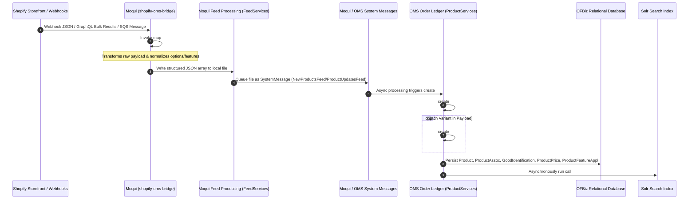
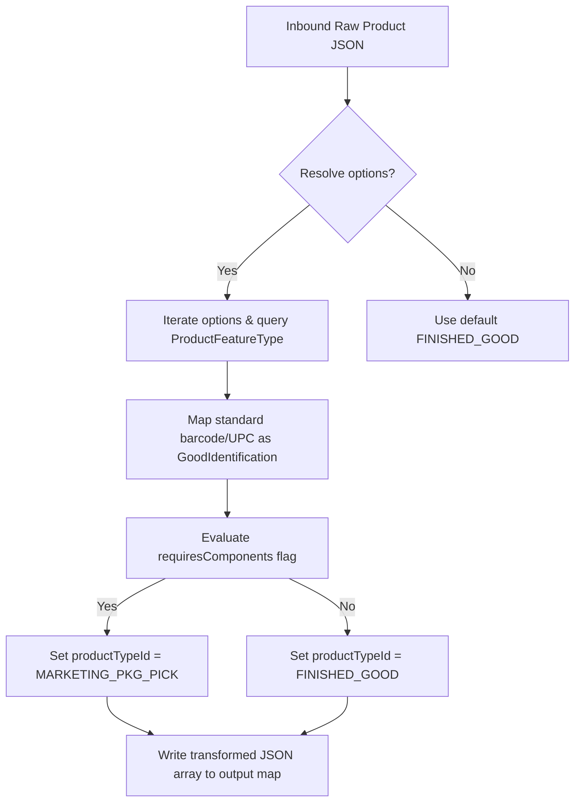
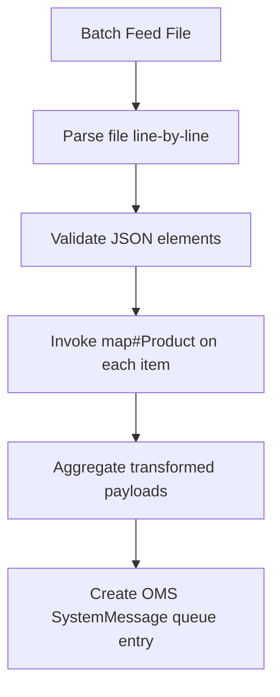
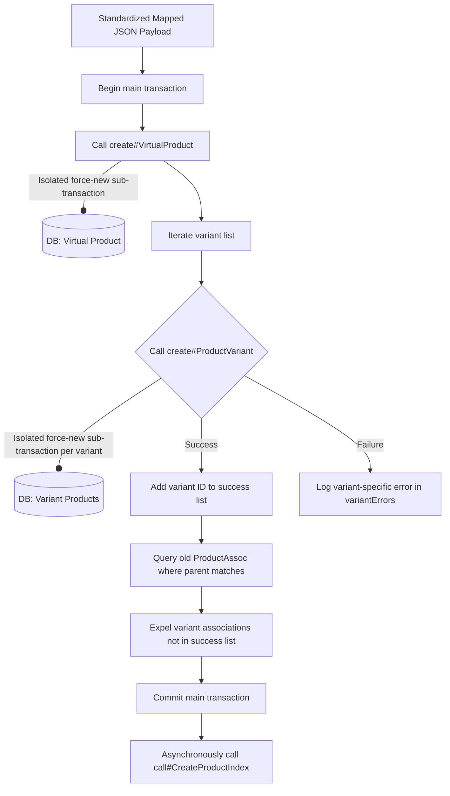
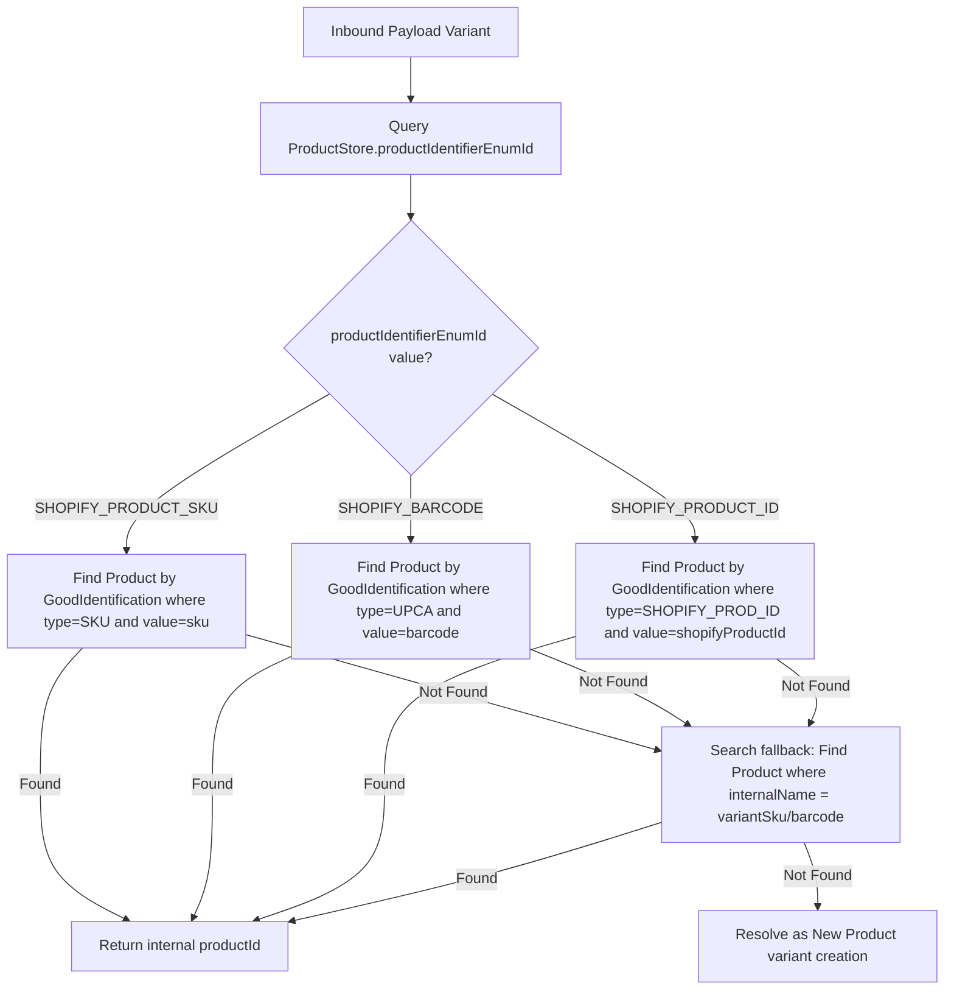
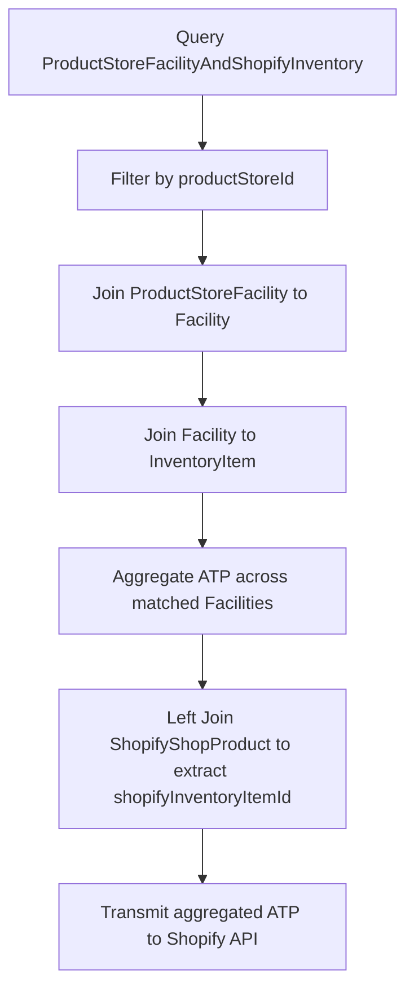
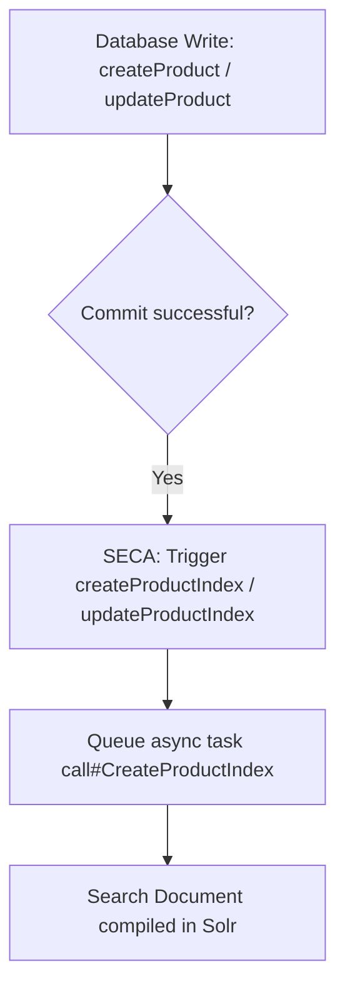

# HotWax Commerce: Product Sync Architecture & Master Data Flow
## High-Performance Integration & Core Ledger Technical Reference

This document provides a deep, implementation-level technical reference of the **Product Sync Flow** between Shopify, the Moqui Orchestration/Integration Layer (`maarg`), and the core OFBiz transactional ERP backend (`ofbiz-oms`). It is designed for developers, systems architects, and production-debugging engineers to understand the end-to-end execution flows, transaction boundaries, asynchronous queuing, relational mappings, and data persistence layers.

---

## 1. Product Sync Architecture Overview

The HotWax Commerce product sync operates on a decoupled, asynchronous, and high-performance **Split-Component Architecture**:
1. **Integration and Orchestration Layer (`maarg`)**: Built on the Moqui Framework, this component handles external integration endpoints, ingestion of AWS SQS queues, webhook parsing, GraphQL bulk data parsing, data transformation, and scheduled integration jobs.
2. **Core Transactional Ledger (`ofbiz-oms`)**: Powered by an Apache OFBiz transactional backend, it enforces relational constraints, maintains search indexes (Solr), and manages physical warehouse facilities, prices, order reservation ledgers, and catalog associations.



### Inbound vs. Outbound Sync Flows
*   **Inbound Sync**: Shopify triggers (webhooks for `products/create`, `products/update`) or bulk schedules push JSON payloads containing virtual parents and variant child structures. `maarg` captures, transforms, maps, and writes these records into a standardized catalog feed file before enqueuing them as OMS `SystemMessage` records.
*   **Outbound Sync**: Inventory availability (ATP calculated across store-linked facilities) and price updates are compiled in batches and broadcasted back to Shopify's GraphQL/REST endpoints.

### Sync State Persistence & Tracking
*   **`ShopifyConfig`**: Stores API credentials, storefront endpoints, and access tokens.
*   **`ShopifyShopProduct`**: A critical bridging table that maps the internal `productId` (e.g., `ECO_HOODIE_RED_S`) to Shopify's external `shopifyProductId`, `shopifyVariantId`, and `shopifyInventoryItemId`.
*   **`SystemMessage`**: The fundamental transactional queue table in Moqui that tracks processing states (`SmsgReceived`, `SmsgSent`, `SmsgProcessed`, `SmsgError`) and stores raw payload file references.

---

## 2. Code Flow Trace

This section traces the exact code execution path for an inbound product sync from raw ingestion to database persistence and search indexing.

### Step 1: External Payload Ingestion
*   **Trigger**: Shopify Webhook event or bulk SQS import.
*   **Service**: `co.hotwax.shopify.webhook.ShopifyWebhookServices.receiveWebhook` (Java) or `co.hotwax.shopify.product.SqsProductImport` (XML Service).
*   **Files**:
    *   `ofbiz-oms/applications/shopify-connector/src/main/java/co/hotwax/shopify/webhook/ShopifyWebhookServices.java`
    *   `maarg/runtime/component/mantle-shopify-connector/service/co/hotwax/shopify/product/SqsProductImport.xml`
*   **Behavior**:
    1. Webhook endpoint captures the incoming JSON payload.
    2. Validates Shopify signature headers (`X-Shopify-Hmac-Sha256`).
    3. Asynchronously writes the raw JSON file to the local staging directory and creates a `SystemMessage` record tracking the receipt.

### Step 2: Product Data Transformation and Mapping
*   **Service**: `co.hotwax.sob.product.ProductMappingServices.map#Product` & `map#ProductVariant`
*   **File**: `maarg/runtime/component/shopify-oms-bridge/service/co/hotwax/sob/product/ProductMappingServices.xml`
*   **Behavior**:
    1. Parsed payload options (e.g., `option1`, `option2`) are evaluated.
    2. Maps option categories (e.g., "Color", "Size") to internal `productFeatureTypeId` records.
    3. Transforms pricing, inventory policies, and barcodes (`barcode` $\rightarrow$ `UPCA`).
    4. Evaluates if the incoming item requires component breakdown (if `payload.hasVariantsThatRequiresComponents` or `requiresComponents` equals `true`), assigning the `productTypeId` as `MARKETING_PKG_PICK` instead of `FINISHED_GOOD`.
    5. Outputs a standardized JSON Array representation to a feed file path.

### Step 3: Local Feed Assembly & Enqueuing to OMS
*   **Service**: `co.hotwax.sob.system.FeedServices.consume#ShopifyChildCatalogUpdatesFeed`
*   **File**: `maarg/runtime/component/shopify-oms-bridge/service/co/hotwax/sob/system/FeedServices.xml`
*   **Behavior**:
    1. Evaluates newly mapped catalog JSON arrays.
    2. Writes structured batch files to the staging directory `/runtime/feeds/oms/products`.
    3. Creates `SystemMessage` records in the `oms` component of type `NewProductsFeed` or `ProductUpdatesFeed`.

### Step 4: Core Ledger Product Persistence Dispatcher
*   **Service**: Implemented in Moqui SystemMessage consume logic for `NewProductsFeed` and `ProductUpdatesFeed` system message types.
*   **File**: Defined in `maarg/runtime/component/oms/data/SeedData.xml` mapping to `co.hotwax.orderledger.product.ProductServices.create#ProductAndVariants` or `update#ProductAndVariants`.
*   **Behavior**:
    1. Polling scheduler picks up pending messages of types `NewProductsFeed` or `ProductUpdatesFeed`.
    2. Checks the status of the message in the `SystemMessage` entity.
    3. Dispatches the file payload to `create#ProductAndVariants` or `update#ProductAndVariants` synchronously within a managed transaction.

### Step 5: Core Virtual and Variant Persistence
*   **Service**: `co.hotwax.orderledger.product.ProductServices.create#ProductAndVariants`
*   **File**: `maarg/runtime/component/oms/service/co/hotwax/orderledger/product/ProductServices.xml`
*   **Behavior**:
    1. Extracts variant structures from the payload and holds them in memory.
    2. Calls `create#VirtualProduct` for the parent record.
        *   **Transaction Boundary**: Executes under a dedicated, isolated sub-transaction (`transaction="force-new"`).
        *   **Operations**: Persists style properties in the `Product` entity with `isVirtual="Y"`, maps Shopify shop linkage via `store#co.hotwax.shopify.ShopifyShopProduct`, and sets up initial attributes.
    3. Iterates over child variants and invokes `create#ProductVariant` for each.
        *   **Transaction Boundary**: Each child variant runs in its own isolated transaction (`requireNewTransaction(true)` and `transaction="force-new"`). If one variant fails validation or conflicts, it logs an error in the `variantErrors` array without failing the parent virtual style or other variant records.
        *   **Operations**: Persists child variant details in `Product` with `isVariant="Y"` and `isVirtual="N"`, adds barcode/UPCA aliases in `GoodIdentification`, maps standard features in `ProductFeatureAppl` (using `productFeatureApplTypeId="STANDARD_FEATURE"`), and sets base pricing in `ProductPrice`.
    4. Creates `ProductAssoc` records linking virtual parents to variant children with `productAssocTypeId="PRODUCT_VARIANT"`.
    5. Clean up: Determines if any existing variant associations in the database are no longer part of the sync payload; if found, they are deleted from `ProductAssoc` to remove orphaned variants.

### Step 6: Solr Search Indexing Hook
*   **Service**: `co.hotwax.oms.search.SearchServices.call#CreateProductIndex` (or via Search SECA rules).
*   **Files**:
    *   `maarg/runtime/component/oms/service/co/hotwax/orderledger/product/ProductServices.xml`
    *   `ofbiz-oms/applications/hwmapps/servicedef/search/secas.xml`
*   **Behavior**:
    1. Following a successful database commit of virtual and variant records, an asynchronous call is dispatched to index the parent and variant structure in Solr.
    2. This uses the `call#CreateProductIndex` service or triggers search SECAs (e.g., `createProduct` / `updateProduct` commit events).
    3. Rebuilds the search document representing the style category, features, prices, and available facility inventory, ensuring near real-time storefront synchronization.

---

## 3. Service Orchestration Graph

Below are execution graphs, configuration specifications, and error handling policies for six critical sync-related services.

---

### Service 1: `co.hotwax.sob.product.ProductMappingServices.map#Product`



*   **File Path**: `maarg/runtime/component/shopify-oms-bridge/service/co/hotwax/sob/product/ProductMappingServices.xml`
*   **Service Type**: XML service utilizing inline Groovy scripting.
*   **Auth Setting**: `auth="true"` (requires an active system/user session context).
*   **Transaction Setting**: `use-transaction="true"` (participates in caller's active transaction).
*   **Inputs**:
    *   `productJson` (Map - raw Shopify payload)
    *   `shopId` (String - target storefront mapping identifier)
*   **Outputs**:
    *   `mappedProduct` (Map - schema-compliant nested product structure)
*   **Internal Behavior**:
    1. Extracts core attributes (`title`, `handle`, `vendor`, `variants`).
    2. Runs fuzzy logic match against `ProductFeatureType` using the description field to identify options (e.g., option1 description "Shade" maps to `COLOR`).
    3. Inspects variant attributes to decide whether it requires a component assembly line, dynamically switching the mapped `productTypeId`.
*   **Downstream Calls**: None (pure data transformation).
*   **Failure Handling**: Throws custom parsing validation exceptions; parent job captures exception and marks the corresponding `SystemMessage` as `SmsgError`.

---

### Service 2: `co.hotwax.sob.system.FeedServices.consume#ShopifyChildCatalogUpdatesFeed`



*   **File Path**: `maarg/runtime/component/shopify-oms-bridge/service/co/hotwax/sob/system/FeedServices.xml`
*   **Service Type**: XML Service.
*   **Auth Setting**: `auth="true"`
*   **Transaction Setting**: `use-transaction="true"`
*   **Inputs**:
    *   `feedFilePath` (String - absolute path to incoming Shopify catalog JSON feed)
*   **Outputs**:
    *   `systemMessageId` (String - identifier of created OMS queue message)
*   **Internal Behavior**:
    1. Opens file buffer stream.
    2. Reads records line-by-line using a streaming JSON reader.
    3. Validates mandatory schema properties.
    4. Saves clean batches to the configured staging path `/runtime/feeds/oms/products`.
    5. Saves a system message record to the database linking to the generated batch file.
*   **Downstream Calls**:
    *   `co.hotwax.sob.product.ProductMappingServices.map#Product` (Sync / In-line)
*   **Failure Handling**: Rollback-on-error behavior; deletes staging files on failure and populates standard system error logs.

---

### Service 3: `co.hotwax.orderledger.product.ProductServices.create#ProductAndVariants`



*   **File Path**: `maarg/runtime/component/oms/service/co/hotwax/orderledger/product/ProductServices.xml`
*   **Service Type**: XML Service.
*   **Auth Setting**: `auth="true"`
*   **Transaction Setting**: `use-transaction="true"` (Outer orchestrating transaction).
*   **Inputs**:
    *   `productJson` (Map - standardized schema payload)
*   **Outputs**:
    *   `parentProductId` (String - internal ID of virtual parent product)
    *   `variantErrors` (List of Maps - collection of specific errors for failed variant creations)
*   **Internal Behavior**:
    1. Separates variant payload structures from virtual parent payload.
    2. Dispatches `create#VirtualProduct` in an isolated nested transaction (`force-new`).
    3. Traverses child variant objects, dispatching `create#ProductVariant` inside isolated nested transactions (`force-new`).
    4. Evaluates database `ProductAssoc` records for the resolved parent. If an associated variant is not present in the inbound payload success list, it expires or deletes the `ProductAssoc` link.
*   **Downstream Calls**:
    *   `co.hotwax.orderledger.product.ProductServices.create#VirtualProduct` (Sync / Force-New)
    *   `co.hotwax.orderledger.product.ProductServices.create#ProductVariant` (Sync / Force-New / Loop)
    *   `co.hotwax.oms.search.SearchServices.call#CreateProductIndex` (Async / Event-driven)
*   **Failure Handling**: If the orchestrating virtual product creation fails, the outer transaction rolls back. If individual variant creations fail, their sub-transactions roll back independently, their errors are added to `variantErrors`, and processing continues for other variants.

---

### Service 4: `co.hotwax.orderledger.product.ProductServices.create#VirtualProduct`

*   **File Path**: `maarg/runtime/component/oms/service/co/hotwax/orderledger/product/ProductServices.xml`
*   **Service Type**: XML Service.
*   **Auth Setting**: `auth="true"`
*   **Transaction Setting**: `requireNewTransaction(true)` & `transaction="force-new"` (isolated sub-transaction).
*   **Inputs**:
    *   `productJson` (Map)
*   **Outputs**:
    *   `productId` (String)
*   **Internal Behavior**:
    1. Executes a uniqueness lookup: Queries the database `Product` table for an existing record matching the `internalName` field in `productJson`.
    2. If found:
        *   Retrieves its `productId`.
        *   Updates Shopify shop mapping by invoking `store#co.hotwax.shopify.ShopifyShopProduct` to link `shopifyProductId` and `shopId`.
        *   Returns the matched `productId`.
    3. If not found:
        *   Invokes `prepare#ProductCreate` to clean selectable features, prices, and identifications.
        *   Calls `create#org.apache.ofbiz.product.product.Product` to persist the virtual parent record (`isVirtual="Y"`, `isVariant="N"`).
        *   Creates a new `ShopifyShopProduct` mapping.
*   **Downstream Calls**:
    *   `co.hotwax.orderledger.product.ProductServices.prepare#ProductCreate` (Sync)
*   **Failure Handling**: Any entity level constraint exception forces rollback of the isolated sub-transaction, returning control to the caller with the exception detail.

---

### Service 5: `co.hotwax.orderledger.product.ProductServices.create#ProductVariant`

*   **File Path**: `maarg/runtime/component/oms/service/co/hotwax/orderledger/product/ProductServices.xml`
*   **Service Type**: XML Service.
*   **Auth Setting**: `auth="true"`
*   **Transaction Setting**: `requireNewTransaction(true)` & `transaction="force-new"` (isolated sub-transaction).
*   **Inputs**:
    *   `productVariantJson` (Map)
    *   `parentProductId` (String)
*   **Outputs**:
    *   `productId` (String)
*   **Internal Behavior**:
    1. Validates that `internalName` is defined in `productVariantJson`.
    2. Uniqueness check: Queries `Product` database record by `internalName` to see if variant already exists.
    3. If variant exists:
        *   Retrieves `productId`.
        *   Invokes `store#co.hotwax.shopify.ShopifyShopProduct` to ensure variant is linked to the correct storefront and has its external IDs correctly stored.
        *   Validates and creates `ProductAssoc` mapping linking to `parentProductId` with type `PRODUCT_VARIANT`.
    4. If variant does not exist:
        *   Invokes `prepare#ProductCreate` to compile variant features (`STANDARD_FEATURE`), identifications, and pricing structures.
        *   Invokes `create#org.apache.ofbiz.product.product.Product` to create the child record (`isVariant="Y"`, `isVirtual="N"`).
        *   Persists `ProductAssoc` linking child variant to parent virtual.
        *   Persists `ShopifyShopProduct` linking the child variant to external Shopify IDs.
*   **Downstream Calls**:
    *   `co.hotwax.orderledger.product.ProductServices.prepare#ProductCreate` (Sync)
*   **Failure Handling**: Rollback is contained to this specific variant sub-transaction. Exception is caught, logged in processing collections, and does not halt execution of surrounding variants in the batch.

---

### Service 6: `co.hotwax.orderledger.product.ProductServices.update#ProductAndVariants`

*   **File Path**: `maarg/runtime/component/oms/service/co/hotwax/orderledger/product/ProductServices.xml`
*   **Service Type**: XML Service.
*   **Auth Setting**: `auth="true"`
*   **Transaction Setting**: `use-transaction="true"`
*   **Inputs**:
    *   `productJson` (Map - mapped update payload)
*   **Outputs**:
    *   `parentProductId` (String)
    *   `variantErrors` (List of Maps)
*   **Internal Behavior**:
    1. Separates variant collections from virtual parent updates.
    2. Triggers `update#VirtualProduct` to evaluate and update virtual parent records in the database.
    3. Loops through child variants, invoking `update#ProductVariant` inside isolated sub-transactions.
    4. Performs differential delta reconciliation on `ProductAssoc` records, expiring variant associations that are not present in the update payload.
*   **Downstream Calls**:
    *   `co.hotwax.orderledger.product.ProductServices.update#VirtualProduct` (Sync)
    *   `co.hotwax.orderledger.product.ProductServices.update#ProductVariant` (Sync / Loop)
    *   `co.hotwax.oms.search.SearchServices.call#CreateProductIndex` (Async)
*   **Failure Handling**: Failure in virtual parent update rolls back entire transaction. Individual variant update failures are isolated to their own `force-new` sub-transaction, logged, and bypassed.

---

## 4. Entity Write Map

Below is a relational write/read dependency map detailing how critical database entities are created, updated, and accessed throughout the product sync cycle.

| Entity Name | Database Table | Created By | Updated By | Read By | Mutated By |
| :--- | :--- | :--- | :--- | :--- | :--- |
| **`Product`** | `PRODUCT` | `create#VirtualProduct`<br>`create#ProductVariant` | `update#VirtualProduct`<br>`update#ProductVariant` | `prepare#ProductCreate`<br>`prepare#ProductUpdate`<br>Solr Search Indexer | Services defining core catalog data |
| **`ProductAssoc`** | `PRODUCT_ASSOC` | `create#ProductVariant`<br>`update#ProductVariant` | `update#ProductAndVariants`<br>(thruDate expiration) | `update#ProductAndVariants`<br>Order Item Reservation | Catalog management services |
| **`ProductFeatureAppl`** | `PRODUCT_FEATURE_APPL` | `prepare#ProductCreate` | `prepare#ProductUpdate`<br>(thruDate expiration) | Solr Search Indexer<br>PDP Page Resolver | Merchandising tools |
| **`ProductPrice`** | `PRODUCT_PRICE` | `prepare#ProductCreate` | `prepare#ProductUpdate` | `calculateProductPrice`<br>Shopify Price Export | Price engine schedulers |
| **`ProductCategoryMember`** | `PRODUCT_CATEGORY_MEMBER` | `prepare#ProductCreate` | `prepare#ProductUpdate` | Storefront Navigation<br>Solr Search Indexer | Category mapping tools |
| **`GoodIdentification`** | `GOOD_IDENTIFICATION` | `prepare#ProductCreate` | `prepare#ProductUpdate` | `findProductByGoodIdentification` | Barcode scanners, Import resolvers |
| **`InventoryItem`** | `INVENTORY_ITEM` | Warehouse Receiving | WMS Sync Adjustment | ATP Calculator<br>Fulfillment Engine | Orders reserving stock |
| **`ProductStoreCatalog`** | `PRODUCT_STORE_CATALOG` | Administrative Portal | Merchandising Portal | Session Store Resolver<br>Catalog Exporter | Sales configuration jobs |
| **`ShopifyShopProduct`** | `SHOPIFY_SHOP_PRODUCT` | `create#VirtualProduct`<br>`create#ProductVariant` | `update#VirtualProduct`<br>`update#ProductVariant` | Outbound inventory feeds<br>Outbound price updates | Webhook update handlers |
| **`SystemMessage`** | `SYSTEM_MESSAGE` | Webhook receiver<br>SqsProductImport | Message processing jobs | Scheduled consumer pools | Message queue processors |

---

## 5. Shopify / External Mapping Logic

When external payloads are received, resolving standard identifier values to internal primary keys represents the most critical operational gateway.

### Identifier Classifications
The database maps Shopify and standard identification values to the following `goodIdentificationTypeId` categories:
*   **`SHOPIFY_PROD_ID`**: Stores the absolute external Shopify Product Identifier (e.g., `gid://shopify/Product/123456789`).
*   **`SKU`**: Stores the warehouse SKU identifier representing the unique variant structure.
*   **`UPCA`**: Stores the Universal Product Code (barcode) scan value.

### Product Resolution and Matching Algorithm


1.  **Read Context Configuration**: The sync engine queries the corresponding `ProductStore` profile configuration to retrieve the `productIdentifierEnumId`.
2.  **Step 1 Lookup (Primary Key Match)**:
    *   If `productIdentifierEnumId` is set to `SHOPIFY_PRODUCT_SKU`, queries `GoodIdentification` for a match where `goodIdentificationTypeId="SKU"` and `idValue` matches the payload's `sku`.
    *   If set to `SHOPIFY_BARCODE`, queries `GoodIdentification` where `goodIdentificationTypeId="UPCA"` and `idValue` matches payload `barcode`.
    *   If set to `SHOPIFY_PRODUCT_ID`, queries `GoodIdentification` where `goodIdentificationTypeId="SHOPIFY_PROD_ID"` and `idValue` matches external Shopify ID.
3.  **Step 2 Lookup (Database Fallback)**: If no match is found, the system performs a fallback search querying the `Product` entity directly where `internalName` matches the SKU value. This serves as a recovery mechanism in cases where mapping records in `GoodIdentification` were lost or not created during a previous import.
4.  **Idempotency & Conflict Handling**: If a product variant lookup resolves to a record that is currently associated with a different virtual parent product, a `Mapping Conflict Exception` is thrown and the individual variant transaction is aborted and rolled back. If the variant lookup is successful, the transaction proceeds as an **Update** instead of a **Create**, ensuring absolute idempotency.

---

## 6. Variant / Virtual Product Code Flow

Virtual parent templates act as logical style headers, while variant child records represent physical inventory units.

### The Variant Association Engine
*   **Association**: Variant children are associated with the virtual parent via `ProductAssoc`.
*   **Type Specification**: The `productAssocTypeId` is configured as `PRODUCT_VARIANT`.
*   **Temporal Primary Key**: Every association is tracked with a `fromDate` timestamp in the primary key.

### Feature Allocation: Selectable vs. Standard Features
Features (e.g. Size: Medium, Color: Red) are registered globally in `ProductFeature` and applied to virtual and variant items differently:
*   **Virtual Parent (`isVirtual="Y"`)**: Applied as `SELECTABLE_FEATURE` in the `ProductFeatureAppl` junction table (using `productFeatureApplTypeId="SELECTABLE_FEATURE"`). This tells storefront renderers to compile these values into interactive drop-down pickers.
*   **Variant Child (`isVariant="Y"`)**: Applied as `STANDARD_FEATURE` in the `ProductFeatureAppl` junction table (using `productFeatureApplTypeId="STANDARD_FEATURE"`). This specifies the exact, immutable characteristics of that physical SKU.

### Parent-Child Traversal & Synchronization
*   **Traversal**: Finding variant children of a virtual product involves executing a direct database query on `ProductAssoc` where `productId` matches the parent and `productAssocTypeId="PRODUCT_VARIANT"`, filtered by active date boundaries:
    `fromDate <= now AND (thruDate IS NULL OR thruDate > now)`
*   **Inherited Values**: Variant products do not duplicate generic parent values like category paths (`ProductCategoryMember`) or default description content. Instead, standard storefront search engines (Solr) query the active parent-child relational tree, dynamically pulling parent category mappings for child variant listings during index assembly.

### Orphan Variant Cleanup
When an update payload for a virtual parent does not contain a variant child that is currently linked in the database, it indicates the variant has been deleted or moved:
```xml
<entity-find entity-name="ProductAssoc" list="assocList">
    <econstraint field-name="productId" from="parentProductId"/>
    <econstraint field-name="productAssocTypeId" value="PRODUCT_VARIANT"/>
    <econstraint field-name="thruDate" operator="equals" from="null"/>
</entity-find>
<iterate list="assocList" entry="assoc">
    <if condition="!variantProductIds.contains(assoc.productIdTo)">
        <!-- Expire Association -->
        <set field="assoc.thruDate" from="ec.user.nowTimestamp"/>
        <set field="assoc.update" value="true"/>
        <store-value value="assoc"/>
    </if>
</iterate>
```
1.  Queries the database `ProductAssoc` for active variant links (`thruDate is null`).
2.  Filters out associations where `productIdTo` is present in the successful sync variant collection (`variantProductIds`).
3.  For any obsolete variant links remaining, sets `thruDate` to `now` and persists the change, gracefully dissolving the association without deleting the historical variant SKU database record.

---

## 7. Bundle / Kit / Marketing Package Flow

Bundles and kits are configurations that represent a collection of component items sold as a unified package.

### Kit Structural Representation
*   **`ProductType`**: Bundles are represented by a dedicated product record where `productTypeId` is set to `MARKETING_PKG_PICK`.
*   **Kit Component Association**: Core component relationships are mapped in `ProductAssoc` where `productAssocTypeId` is defined as `PRODUCT_COMPONENT`.
*   **Component Quantity Ratio**: The association stores the required quantity ratio of each constituent component in the `quantity` field (e.g. a "3-Pack of Socks" bundle links to a physical variant with `quantity="3.0"`).

### Bundle Explosion and Inventory Deduction
1.  **Fulfillment Logic**: When an order containing a `MARKETING_PKG_PICK` line item is approved, the order ledger does not reserve inventory for the bundle itself.
2.  **Component Explosion**: The fulfillment engine reads the active `PRODUCT_COMPONENT` associations for the bundle ID and explodes the item into its constituent parts in memory.
3.  **Physical Reservation**: Creates separate `OrderItemShipGrpInvRes` records against the physical inventory units of each underlying variant component.
4.  **ATP Calculations**: The Available to Promise (ATP) quantity of a bundle product is dynamic:
    $$\text{Bundle ATP} = \min_{c \in \text{Components}} \left( \lfloor \frac{\text{Component } c \text{ ATP}}{\text{Quantity Ratio } c} \rfloor \right)$$
    The system traverses all active component variants, calculates their respective ATP levels, divides them by the required quantity ratio, and returns the lowest resulting integer as the aggregate sellable quantity for the storefront.

---

## 8. Inventory Linkage Flow

Product synchronization establishes the foundational catalog, but real-time integration relies on active inventory linkage.

### The Physical-to-Logical Inventory Ledger
Inventory levels are tracked in `InventoryItem` and updated via the transaction ledger `InventoryItemDetail`.
*   **Quantity on Hand (QOH)**: Total physical units currently counted on the warehouse shelves.
*   **Available to Promise (ATP)**: Sellable units available for customer orders. ATP is calculated by subtracting open, unfulfilled orders from QOH:
    $$\text{ATP} = \text{QOH} - \sum \text{Active Reservations}$$

### Inventory Availability View Schemas
In `maarg`, high-performance custom view schemas are utilized to aggregate warehouse stock levels and link them directly to Shopify storefront records:

1.  **`ShopifyProductInventory`**:
    *   **Purpose**: Joins custom storefront tracking tables with core warehouse inventory records.
    *   **Structure**: Joins `ShopifyShopProduct` (linking to storefront variant profiles) $\rightarrow$ `Product` $\rightarrow$ `InventoryItem` $\rightarrow$ `Facility`.
    *   **Usage**: Used by batch export jobs to quickly sum up warehouse stock levels and extract the target Shopify `shopifyInventoryItemId` required for API calls.

2.  **`ProductStoreFacilityAndShopifyInventory`**:
    *   **Purpose**: Filters inventory based on the explicit fulfillment facilities assigned to a specific storefront.
    *   **Structure**: Joins `ProductStoreFacility` $\rightarrow$ `Facility` $\rightarrow$ `InventoryItem` $\rightarrow$ `ShopifyShopProduct`.
    *   **Usage**: Prevents warehouse stock from unrelated physical stores from being aggregated into online storefront availability calculations.



### Aggregate Availability Sync Flow
1.  Scheduled task initiates `co.hotwax.shopify.product.InventorySyncJob`.
2.  Queries `ProductStoreFacilityAndShopifyInventory` filtered by `productStoreId`.
3.  Sums the total `availableToPromiseTotal` for each unique `productId`.
4.  Optionally subtracts configured "Safety Stock" thresholds (configured in `ProductFacility`).
5.  Extracts the Shopify tracking value `shopifyInventoryItemId` and pushes the net quantity directly to the storefront API.

---

## 9. Async Processing & Jobs

The product sync architecture relies on several asynchronous queues and scheduled background tasks to process large catalog volumes efficiently.

| Job / Service Name | File Path / Configuration | Trigger Condition | Max Retries | Failure Persistence | Recovery / Rollback Behavior |
| :--- | :--- | :--- | :---: | :--- | :--- |
| **`ConsumeOMSNewProductsFeed`** | `maarg/runtime/component/oms/data/SeedData.xml` | Chron job polling (every 5-15 mins) for new product feed files | 3 | Status changed to `SmsgError`; error stack written to SystemMessage log | Rollback current file transaction; flag message as error; re-queue on next cron sweep |
| **`ConsumeOMSUpdateProductsFeed`** | `maarg/runtime/component/oms/data/SeedData.xml` | Chron job polling for product updates feed files | 3 | `SystemMessage` entry updated with exception traceback | Rollback processing of current update batch; flag error; continue with next batch |
| **`call#CreateProductIndex`** | `maarg/runtime/component/oms/service/co/hotwax/orderledger/product/ProductServices.xml` | Dispatched asynchronously following core product commits | 5 | Logged in background execution pool details | Re-queue indexing task; if repeated failures, triggers administrator email alert |
| **`SqsProductImport`** | `maarg/runtime/component/mantle-shopify-connector/service/co/hotwax/shopify/product/SqsProductImport.xml` | Event-driven webhook / AWS SQS message arrival | Unlimited | SQS Dead Letter Queue (DLQ) integration | Messages unable to parse are moved to AWS DLQ after maximum receive count is exceeded |

---

## 10. SECA / EECA / Hidden Side Effects

Service Event Condition Action (SECA) and Entity Event Condition Action (EECA) rules act as hidden execution triggers.



### Search Indexing Side Effects
In the transactional catalog, modifications to basic product properties or features trigger automated Solr search indexing:
*   **SECA Rule**: Configured in `applications/hwmapps/servicedef/search/secas.xml` in the `ofbiz-oms` backend.
*   **Trigger Service**: `createProduct`, `updateProduct`, `createProductFeatureAppl`, `updateProductFeatureAppl`, `createProductPrice`, and `updateProductPrice` commit events.
*   **Action**: Automatically fires an asynchronous dispatcher call to `createProductIndex` or `updateProductIndex`.
*   **Debugging Implication**: A developer updating pricing or feature allocations via direct SQL statements will bypass the Java service layer. This prevents the SECA from firing, resulting in a database state that differs from the search catalog rendered to storefront customers.

---

## 11. Debugging-Critical Structures

During high-volume production operations, several lightweight or utility entities become highly critical for diagnosing synchronization failures.

1.  **`ShopifyShopProduct`**
    *   **Table Name**: `SHOPIFY_SHOP_PRODUCT`
    *   **Why it matters**: This is the absolute link between internal and external identities. It holds the mapped keys (`shopifyProductId`, `shopifyVariantId`, `shopifyInventoryItemId`).
    *   **Failure Scenario**: If a product has a correct `GoodIdentification` record for its SKU but is missing its corresponding `ShopifyShopProduct` entry, inventory sync jobs will run successfully but will fail to push stock updates to Shopify, generating silent sync failures.
2.  **`SystemMessage`**
    *   **Table Name**: `SYSTEM_MESSAGE`
    *   **Why it matters**: It is the core transactional queue ledger. It records the state of every webhook and feed file processed.
    *   **Failure Scenario**: When synchronization stalls, inspecting the status (`statusId`) and the detailed exception stack trace in the error logs of this entity allows debugging teams to pinpoint exact line number parsing exceptions.
3.  **`ProductAssoc` (thruDate)**
    *   **Table Name**: `PRODUCT_ASSOC`
    *   **Why it matters**: Controls parent-child visibility using temporal fields.
    *   **Failure Scenario**: If an update job fails mid-transaction during variant cleanup, some orphaned variants may retain active `ProductAssoc` records (`thruDate is null`). The variant will remain active on the storefront index and continue to receive orders despite being removed from the Shopify source catalog.
4.  **`ProductPrice` (fromDate)**
    *   **Table Name**: `PRODUCT_PRICE`
    *   **Why it matters**: Stores pricing history using temporal keys.
    *   **Failure Scenario**: When price updates are received, duplicate records with overlapping date windows can be created if timezone offsets are misaligned. This results in the price calculation service throwing multiple active price exceptions during storefront checkouts.

---

## 12. Failure & Recovery Flow

Enterprise catalog operations must gracefully handle transactional boundaries and network issues.

### Partial Batch Failures & Isolation
Within the standard orchestrator service `create#ProductAndVariants`, the use of nested transaction containment prevents a single variant error from failing the entire synchronization feed:
1.  **Virtual Parent Transaction**: The style parent is created or updated in a isolated transaction (`force-new`). If this fails, the entire batch for this style is rolled back.
2.  **Variant Sub-Transactions**: Each variant in the payload is iterated and processed within its own sub-transaction:
    ```xml
    <service-call name="co.hotwax.orderledger.product.ProductServices.create#ProductVariant" 
                  in-map="variantMap" require-new-transaction="true" transaction="force-new"/>
    ```
    If `create#ProductVariant` fails (e.g. due to database constraint violation or duplicate barcode values), the sub-transaction is rolled back, the exact exception is written to `variantErrors`, and processing proceeds to the next variant.

### System Message Recovery Policies
1.  **Stuck Job Sweep**: A scheduled job parses `SystemMessage` records where status is `SmsgReceived` or `SmsgError` with a retry count less than 3.
2.  **Automatic Re-Execution**: The cron job attempts to re-execute the target service (e.g., `ConsumeOMSUpdateProductsFeed`) up to 3 times.
3.  **Dead Letter Queue Handoff**: If the retry count reaches 3, the status is set to `SmsgError`, retries are halted, and an alert is published to the system operations console for manual intervention.

---

## 13. Performance / Scaling Observations

The catalog sync architecture contains design patterns optimized for processing large volumes of data:

### Transaction Isolation Pitfalls
*   The use of isolated sub-transactions (`transaction="force-new"`) on individual variants is critical for batch recovery.
*   **Performance Overhead**: This pattern generates a high transaction overhead. For a product catalog payload containing 1 virtual parent and 50 variant options, the database must open, commit, or rollback **51 separate transactions**. This design pattern can lead to connection pool exhaustion under high concurrency.
*   **Solution**: Integration jobs batch virtual products sequentially rather than processing all virtual products in a single transaction block.

### Caching Strategies
*   Static structural tables (`ProductType`, `ProductFeatureType`, `GoodIdentificationType`) are configured with `cache="true"`. Lookups on these entities hit the local L1 cache, avoiding database roundtrips.
*   The frequently accessed relationship mapping table `ShopifyShopProduct` is **not** cached to prevent stale data issues during real-time inventory and pricing sync processes.

### N+1 Query Risks
*   **The Hazard**: In `prepare#ProductUpdate`, comparing incoming payload features and prices against current database records requires executing individual select statements inside standard loop structures.
*   **Mitigation**: The system pre-fetches active database records for features (`ProductFeatureAppl`) and prices (`ProductPrice`) for all related child variants in a single bulk query using view entities before entering comparison loops, significantly reducing query overhead.

---

## 14. File Index

Below is a categorized index of all files reviewed during the codebase architecture analysis.

### Entities

| File Path | Component | Purpose |
| :--- | :--- | :--- |
| `maarg/runtime/component/ofbiz-oms-udm/entity/ShopifyConnectorEntitymodel.xml` | `ofbiz-oms-udm` | Defines custom Shopify connector database entities (`ShopifyConfig`, `ShopifyShop`, `ShopifyShopProduct`, `ShopifyMetafield`, `ShopifyShopLocation`). |
| `maarg/runtime/component/ofbiz-oms-udm/entity/OmsShopifyViewEntities.xml` | `ofbiz-oms-udm` | Defines high-performance relational database views for inventory availability aggregation. |

### Services

| File Path | Component | Responsibility |
| :--- | :--- | :--- |
| `maarg/runtime/component/shopify-oms-bridge/service/co/hotwax/sob/product/ProductMappingServices.xml` | `shopify-oms-bridge` | Maps Shopify options to internal feature and categorization structures. |
| `maarg/runtime/component/shopify-oms-bridge/service/co/hotwax/sob/system/FeedServices.xml` | `shopify-oms-bridge` | Assembles transformed JSON payloads into local catalog and product update feeds. |
| `maarg/runtime/component/oms/service/co/hotwax/orderledger/product/ProductServices.xml` | `oms` | Standard persistence engine managing virtual/variant creation, pricing, feature applications, and Solr index calls. |
| `ofbiz-oms/applications/shopify-connector/src/main/java/co/hotwax/shopify/webhook/ShopifyWebhookServices.java` | `shopify-connector` | Webhook receiver endpoint validating signature headers and storing raw payloads. |
| `ofbiz-oms/applications/shopify-connector/src/main/java/co/hotwax/shopify/graphQL/ProductServices.java` | `shopify-connector` | Implements Java API methods for executing GraphQL product imports. |
| `ofbiz-oms/applications/shopify-connector/src/main/java/co/hotwax/shopify/graphQL/ShopifyBulkImports.java` | `shopify-connector` | Implements bulk import operations and response parsing. |

### SECA Rules

| File Path | Component | Trigger Responsibility |
| :--- | :--- | :--- |
| `ofbiz-oms/applications/product/servicedef/secas.xml` | `product` | Standard event triggers for inventory variances and transfers. |
| `ofbiz-oms/applications/hwmapps/servicedef/search/secas.xml` | `hwmapps` | Automatically schedules search reindexing tasks on database changes to catalog data. |

### Jobs and Data Schemas

| File Path | Component | Purpose / Trigger |
| :--- | :--- | :--- |
| `maarg/runtime/component/oms/data/SeedData.xml` | `oms` | Defines the standard integration `SystemMessage` types and configures background scheduling. |
| `maarg/runtime/component/shopify-oms-bridge/data/SOBSystemMessageTypeData.xml` | `shopify-oms-bridge` | Registers the message routing channels for inbound and outbound sync operations. |

